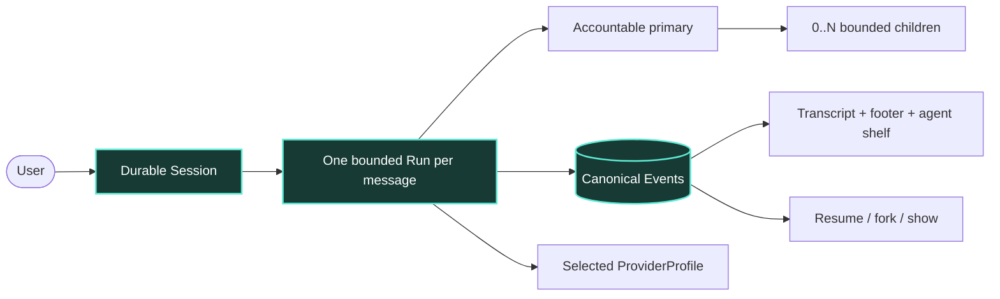
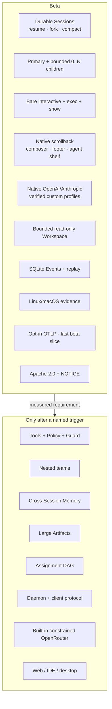
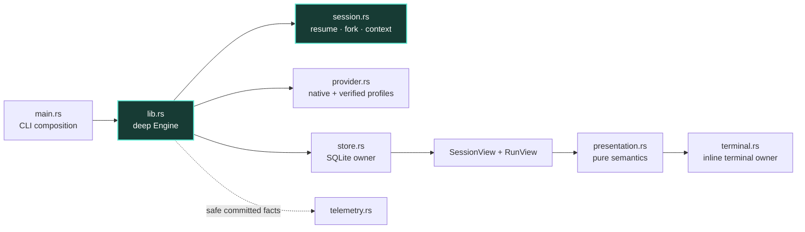
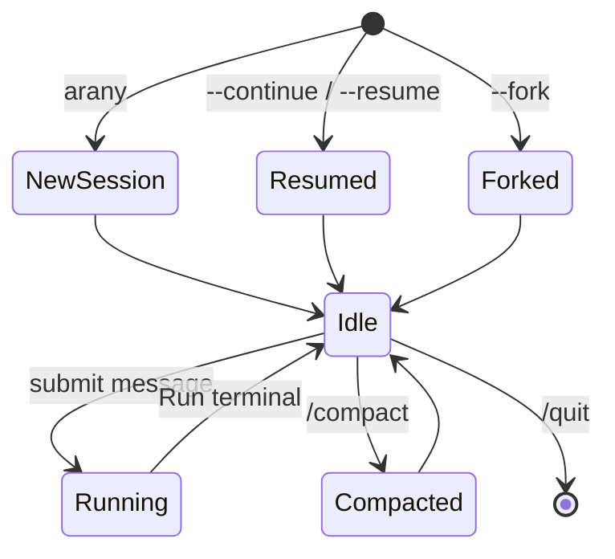
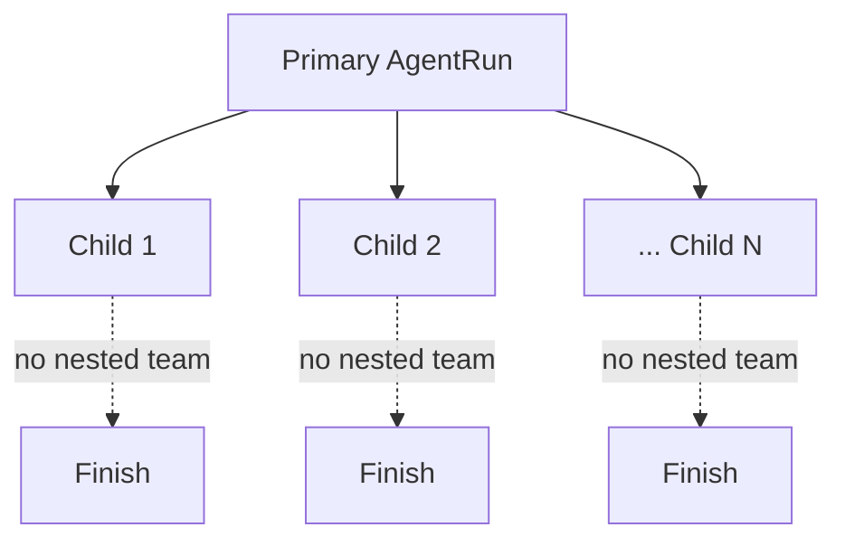
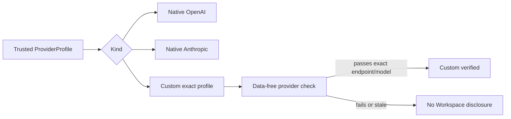
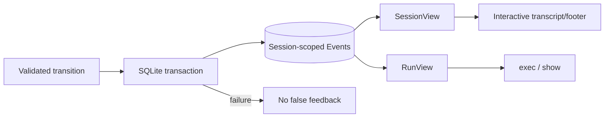
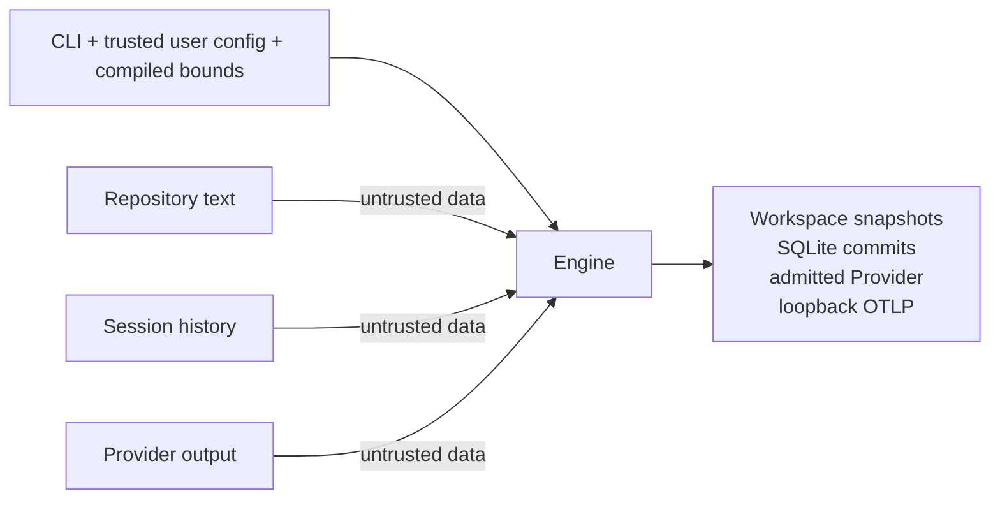

# Arany: conceptual product and architecture map

**Status:** reviewed beta concept before implementation
**Date:** 2026-09-29  
**Audience:** a human validating the product shape
**Purpose:** show the whole beta in one place without turning future capabilities into empty code

This is the human review map. The exact implementation contract lives in [system-overview.md](./system-overview.md), while the research index links the evidence behind each choice.

## 1. Arany in one minute

Arany is a fast, local, CLI-first coding harness with durable Sessions and optional multi-agent execution. Rust owns lifecycle, canonical truth, budgets, cancellation, and future effect enforcement. Models propose work and results; they do not own authority, persistence, scheduling, or what the terminal claims happened.

| Decision | Beta answer |
|---|---|
| Product | **Arany**, invoked as `arany` |
| Platforms | Linux and macOS after native gates |
| Interaction | Durable multi-turn Session with familiar `/` controls |
| Terminal | Native scrollback, composer, compact footer, conditional agent shelf |
| Agents | One primary plus generic budget-bounded `0..N` direct children |
| Collaboration | `single`, `auto`, or explicit `team`; default `auto`, at most three active children |
| Providers | Native OpenAI and Anthropic; exact verified custom profiles; built-in OpenRouter later |
| Authentication | API keys only in beta |
| Durable truth | SQLite Event journal; deterministic Session/Run replay |
| Repository input | Bounded snapshots; root `AGENTS.md`, otherwise root `CLAUDE.md` |
| Local effects | None; therefore no sandbox claim |
| Observability | Opt-in OTLP ships as the final beta slice |
| License | Apache-2.0 plus `NOTICE`, attributed to `fpmirabile` |



The performance promise is measured: local coordination, commits, replay, and rendering should stay small enough that Provider generation dominates ordinary wall time.

## 2. Product principles

1. **Familiar by default.** Reuse established CLI vocabulary, layout, and lifecycle before inventing Arany-specific interaction.
2. **One durable Session.** Conversation history belongs to Arany, not a provider-side thread.
3. **One accountable primary.** Children help; only the primary answers the user.
4. **A team only when useful.** Single-agent work stays visually and operationally simple; team UI emerges from actual delegation.
5. **Facts before feedback.** Persist transitions before presenting them as truth.
6. **Deterministic authority.** Repository text, Session history, and model output are data, never permission.
7. **Deep modules, few seams.** Provider is the beta behavior seam; technology details stay private.
8. **Bound everything.** Agent count, calls, tokens, bytes, queues, storage, deadlines, compaction, and telemetry have limits.
9. **One truth, several views.** Interactive, screen-reader, automation, replay, and telemetry derive from the same committed facts.

## 3. What the beta contains



The triggered side is researched design, not a scaffold list.

## 4. Runtime and module ownership



There is one Cargo package and one process. `session.rs` is earned by durable lifecycle and deterministic context compilation. Ratatui/Crossterm, cursor, mouse, color, focus, and width never cross into Engine types. A future C++ or web client earns a versioned process protocol and daemon rather than linking unstable Rust internals.

## 5. Session lifecycle



- **Session** is the durable conversation and branch identity.
- **Run** is one bounded execution for one accepted user Message.
- **AgentRun** is one primary or child execution inside the Run.

Resume preserves identity and committed history. Fork creates a new Session at an exact committed Run boundary. Interrupted work stays interrupted; retry is a new Run. Historical agents remain inspectable but are not resurrected.

Provider/model/profile and collaboration defaults belong to the Session, but each Run persists the exact resolved values. The user may switch providers between Runs, never inside one.

Compaction is derived context, not deletion. It records the source prefix digest and author/provider/compiler provenance; canonical history remains available to `show` and fork.

## 6. Agent topology



The beta topology is flat and generic over a bounded `N`:

- `single`: the primary cannot delegate;
- `auto(N)`: the primary may delegate when work is genuinely independent; and
- `team(N)`: the user requests a non-empty team decomposition.

The default is `auto` with at most three active children, matching current major-harness guidance while keeping cost visible. Users can choose another `N`, but admission is the minimum of the requested maximum, process ceiling, aggregate budgets, and Provider concurrency. “Supports N” never means unbounded spawning.

With `k` children, a successful team Run needs `k + 2` Provider calls: primary planning, `k` child calls, and primary synthesis. A direct answer needs one. There are no automatic retries or hidden fallbacks.

## 7. What the user sees

The terminal stays a coding harness, not a miniature IDE.

```text
committed transcript in normal terminal scrollback

┌────────────────────────────────────────────────────────────────────┐
│ Add cancellation tests after the current run                     │
└────────────────────────────────────────────────────────────────────┘
auth-refactor · openai/model · read-only · auto · context 61%
● primary       synthesizing  Waiting on security
✓ api-reviewer  finished      3 compatibility gaps
● security      working       Checking credential boundaries
  +2 more · /agents or ↑↓ to inspect
```

The always-visible footer prioritizes Session, Provider/model, permission profile, collaboration mode, and remaining context. Full cost, call budget, paths, request IDs, event sequence, telemetry, and completed-agent history live in `/status`, `/agents`, transcript, or replay.

The activity shelf is data-driven:

- idle: no agent chrome;
- one primary: one row;
- several active/attention agents: at most three rows;
- overflow: `+N more`;
- failed or blocked work stays visible until acknowledged or Run end.

`/agents` opens the full picker and next-Run collaboration controls. It is more familiar across Claude Code, Codex, and OpenCode than inventing `/team`.

Keyboard operation is complete. Mouse reporting is normally off so selection and native scrollback keep working. It may activate transiently only inside an open command, Session, or agent picker; every mouse action has a keyboard equivalent, and RAII cleanup disables it on every close, signal, panic, suspension, cancellation, or error.

Arany never enters alternate screen. Native scrollback plus durable `show` is the chosen transcript model.

## 8. Familiar command surface

```text
/help      /status      /sessions    /new        /clear
/resume    /fork        /rename      /compact    /agents
/provider  /model       /permissions /quit       /exit
```

Startup mirrors established harnesses:

```text
arany [PROMPT]
arany --continue
arany --resume [SESSION]
arany --fork SESSION
arany --collaboration single|auto|team
arany --max-agents N
arany --provider PROFILE
arany --model MODEL

arany exec --output text|jsonl PROMPT
arany show --output text|jsonl SESSION_OR_RUN_ID
arany provider check PROFILE
```

`/clear` is an alias of `/new`, not data deletion. `/provider`, `/model`, and `/agents` settings apply to the next Run while idle. `/permissions` reports facts and makes no sandbox claim. Approval/sandbox controls appear only with real effects and enforcement.

## 9. Providers without lock-in



Custom profiles provide Roo Code-like flexibility without pretending every OpenAI-shaped endpoint is compatible. A profile names a closed protocol family, exact endpoint/base path, model, credential reference, output encoding, and evidence version. It lives in trusted user configuration outside the Workspace.

`arany provider check PROFILE` uses synthetic data to prove strict `Delegate | Finish`, server-side output limits, route/model stability, bounded response/error behavior, cancellation, and safe usage provenance. Relevant endpoint/model/adapter/test changes invalidate the result. Unverified profiles cannot receive Workspace content.

The first custom family is `openai-responses`; more families earn separate review. Non-loopback endpoints require HTTPS. No redirects, ambient proxies, arbitrary headers, shell credential commands, model discovery, or credential reuse across origins.

A built-in OpenRouter profile is not required for the first beta milestone; it enters only after broker routing, privacy, provenance, strict output, and no-fallback gates. Z.AI remains unadmitted while strict outcome enforcement is absent.

Consumer subscriptions remain outside beta: OpenAI's official plan-funded route cannot currently enforce Arany's remote output cap, and Anthropic requires prior approval for third-party subscription login.

## 10. Durable truth



The Event journal records Session identity, Messages, fork/default/compaction facts, Runs, AgentRuns, pinned policies/profiles, usage, and terminal outcomes. Session/Run/Agent state is reduced, not duplicated as competing truth. A crash leaves a valid prefix and replay labels incomplete work `Interrupted`.

SQLite remains the right local store because transactions, recovery, constraints, indexed replay, and migration arrive without a service. A custom file journal would make Arany own those mechanisms; PostgreSQL would impose an operator before multi-host or multi-writer requirements exist.

## 11. Security boundary

The read-only beta permits bounded Workspace snapshots, admitted Provider egress, private canonical state, terminal rendering, and opt-in loopback telemetry. It has no shell, write-capable Tool, MCP, arbitrary fetch, plugin runtime, listener, or callback and therefore makes no sandbox claim.



Custom endpoints do not weaken the boundary: only trusted profiles with current exact conformance evidence receive Workspace data, and credentials are origin-bound. Session history and compaction remain data, never instructions or authority merely because they were persisted.

The first effectful Tool still requires immutable typed effects, deterministic restrict-only Policy, digest-bound approval, and a separately privileged Guard with effective-capability attestation.

## 12. OTLP is small but important

OTLP ships last in beta, not after an unknown future operator request. It remains opt-in at runtime.

Each Run becomes one trace correlated with safe Session, Run, and AgentRun IDs. Dynamic bounded spans cover each active agent, Provider call, context compilation/compaction, and durable transition timing. This lets external systems answer “which agents are active, waiting, slow, failed, or expensive?” without exporting objectives, Messages, prompts, summaries, results, paths, Event payloads, headers, or credentials.

Events remain product truth; telemetry may drop or fail. The explicit numeric-loopback Collector owns remote TLS, authentication, routing, and backend secrets.

## 13. Testing philosophy

Testing optimizes for evidence, not test count. One central deterministic Session journey proves:

- new Session, single-agent Run, exit, and resume;
- provider/profile change between Runs;
- one bounded N-child team with controlled completion;
- fork lineage and compaction failure safety;
- cancellation of all active children;
- exact automation output; and
- closed-store replay into the same SessionView/RunView.

Compact tables own boundary values and hostile inputs. TestBackend owns semantic footer/shelf frames. Native Linux/macOS PTYs own native scrollback, keyboard pickers, transient mouse, resize, signals, suspension, and restoration. Native Providers own explicit paid smokes; custom profiles own data-free exact conformance before any Workspace-bearing test.

## 14. License decision

Arany uses **Apache-2.0 plus `NOTICE`**. This allows free use and modification, requires redistributed derivatives to preserve applicable attribution and mark modified files, and includes an explicit patent grant.

It cannot force private users or hosted services to display public credit. A mandatory visible “Powered by” rule would require a custom lawyer-reviewed license and would not be the ordinary standard open-source expectation. Do not dual-license with MIT, because recipients could choose MIT and bypass the Apache-specific NOTICE and changed-file obligations.

The repository includes the exact Apache-2.0 `LICENSE` and a `NOTICE` attributed to `fpmirabile`; release artifacts must preserve both.

## 15. Roadmap by trigger

| Trigger | Add then | Keep out before |
|---|---|---|
| First effectful Tool | EffectIntent, Policy, approval proof, Guard | Shell/MCP/process execution |
| Children need delegation | Bounded nested supervision/depth | Recursive teams in beta |
| Agents write concurrently | Isolated Workspace views + integrator | Shared mutable checkout |
| Cross-Session knowledge improves later work | Scoped Memory + retrieval/deletion evaluation | “Remember everything” |
| Event payload limit is exceeded | Content-addressed Artifacts | Blob-heavy Events |
| Second Client or detached execution exists | Daemon + versioned local protocol | Speculative server |
| Built-in OpenRouter is claimed | Route/privacy/provenance/strict gates | Broker claim without evidence |
| Subscription gates clear | Official provider-specific auth | Imported CLI tokens/private routes |
| Remote or multi-tenant product exists | New authz, quota, encryption, retention, threat model | Reusing local trust assumptions |

## 16. Decisions resolved by human review

| Question | Decision |
|---|---|
| Feedback density | Familiar composer/footer first; agent shelf only when useful |
| Scrollback | Normal native scrollback; never alternate-screen transcript ownership |
| Mouse | Transient picker/panel enhancement with complete keyboard parity |
| OTLP | Ship last in beta; opt-in at runtime |
| License | Apache-2.0 + NOTICE, attributed to `fpmirabile` |
| Team size | Generic bounded `N`, default `auto` with at most three active children |
| Provider rollout | Native OpenAI/Anthropic plus verified custom profiles; built-in OpenRouter later |
| Interaction | Real durable Sessions with resume/fork/compaction in beta |

## 17. Detailed evidence

- [Canonical beta architecture](./system-overview.md)
- [Decision register](../research/next-step-decision-register.md)
- [Sessions, teams, terminal, providers, and license](../research/beta-sessions-teams-terminal-providers-and-license.md)
- [Terminal interface research](../research/beta-terminal-interface-and-multi-agent-feedback.md)
- [Interactive CLI conventions](../research/interactive-cli-conventions-and-command-surface.md)
- [Provider routing](../research/beta-multi-provider-routing-and-adapters.md)
- [Subscription authentication](../research/consumer-subscription-authentication-for-provider-adapters.md)
- [Context and compaction](../research/context-memory-and-compaction.md)
- [Security lessons](../research/harness-security-lessons-and-controls.md)
- [Testing strategy](../research/testing-strategy-for-rust-cli-harness.md)
- [OTLP observability](../research/otlp-observability.md)
