# Arany: conceptual product and architecture map

**Status:** review draft before implementation  
**Date:** 2026-09-29  
**Audience:** a human deciding whether the product shape is right  
**Purpose:** show the whole idea in one place without turning every researched capability into beta code

This is the review map for Arany. It combines the product idea, beta boundary, runtime behavior, module ownership, security model, persistence, testing, observability, and future triggers. It is deliberately visual and omits low-level constants that are already settled in the [canonical minimum architecture](./system-overview.md) and [decision register](../research/next-step-decision-register.md).

If this document feels wrong conceptually, change the concept before writing code.

## 1. Arany in one minute

Arany is a fast, local, CLI-first harness for coordinating a team of coding agents. Rust owns the execution Engine, durable truth, resource bounds, cancellation, and future effect enforcement. Models propose work and produce results; they do not own authority, scheduling, persistence, or what the terminal claims happened.

The beta is intentionally small:

| Decision | Beta answer |
|---|---|
| Product and binary | **Arany**, invoked as `arany` |
| Platforms | Linux and macOS, each gated by native behavior tests |
| Experience | CLI only; append-only text, no TUI or web UI |
| Team | One root orchestrator and exactly two concurrent read-only workers |
| Model backend | OpenAI plus a deterministic scripted Provider for proof |
| Durable truth | One SQLite Event journal; `arany show` replays it |
| Repository input | Explicit bounded snapshots; root `AGENTS.md`, otherwise root `CLAUDE.md` |
| Local effects | None in the first slice; therefore no sandbox claim |
| Observability | Optional bounded OTLP traces to a local Collector after the core proof |
| Distribution intent | Available without purchase and with author attribution; exact license still to be selected |

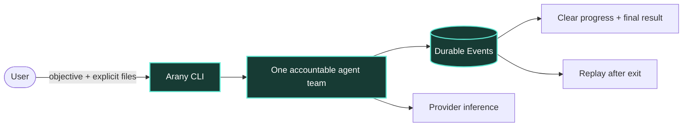

The performance goal is not “zero local latency.” It is that bounded local coordination, commits, replay, and rendering are small and measurable enough that Provider generation dominates normal wall time.

## 2. Product principles

1. **One accountable root.** Workers help; only the root owns the final answer to the user.
2. **One reusable loop.** Root and workers use the same Engine loop with different allowed outcomes and narrower child inputs.
3. **Facts before feedback.** Arany persists a state transition before presenting it as fact.
4. **Deterministic authority.** Repository text and model output are data, never permission.
5. **Deep modules, few seams.** Hide complexity behind small interfaces; do not create a crate, trait, or service for every noun.
6. **Bound everything.** Inputs, calls, tokens, queues, database growth, deadlines, cancellation, and telemetry have explicit limits.
7. **One truth, many possible views.** SQLite Events produce the CLI view today and can feed other clients later.
8. **Prove before expanding.** A feature or boundary enters only when a real product trigger earns it.

## 3. What exists now, next, and later

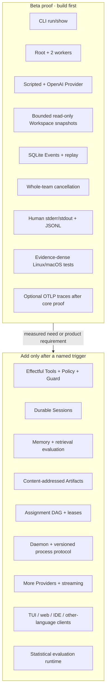

The right-hand side is researched architecture, not a scaffold list. It should not create empty modules in the first repository shape.

## 4. Runtime architecture

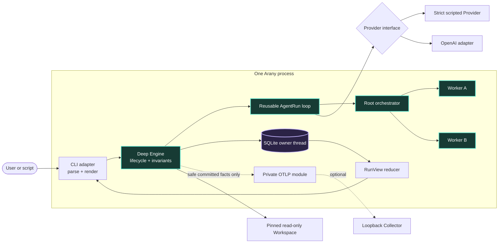

### The one real beta seam

Provider is the only substitutable Engine behavior in the beta because two implementations exist immediately: the deterministic fake and OpenAI. The following are private Engine implementation details, not public abstractions:

- scheduling and join behavior;
- SQLite transactions and replay;
- instruction and include resolution;
- context assembly;
- RunView reduction;
- CLI progress production; and
- optional OTLP projection.

This keeps the Engine deep: callers ask it to run, observe, replay, or cancel; they do not assemble its internal steps in the right order.

## 5. Physical beta shape

```text
Cargo.toml
src/
├── main.rs          CLI adapter and composition
├── lib.rs           deep Engine, loop, team, and RunView
├── provider.rs      Provider contract, scripted fake, OpenAI adapter
├── store.rs         private SQLite owner, append, migration, replay
└── telemetry.rs     optional private OTLP trace projection
tests/
└── team_run.rs      central deterministic product journey
```

There is one Cargo package and one process. A private function becomes a module only when it gains real depth. A module becomes a crate only when dependency isolation, independent consumption, release, ownership, compile time, or privilege separation provides a measured benefit.

## 6. The complete successful Run

```mermaid
sequenceDiagram
    actor U as User
    participant C as arany CLI
    participant E as Engine
    participant S as SQLite store
    participant P as Provider

    U->>C: arany run OBJECTIVE --include ...
    C->>E: trusted config + bounded input request
    E->>E: pin state root and Workspace
    E->>E: snapshot AGENTS.md or fallback CLAUDE.md
    E->>E: snapshot explicit include files
    E->>S: commit RunStarted
    S-->>C: committed progress fact
    E->>P: RootPlan
    P-->>E: Delegate(worker A, worker B)
    E->>S: commit two AgentSpawned facts
    par independent read-only work
        E->>P: ChildWork A
        P-->>E: Finish A
    and
        E->>P: ChildWork B
        P-->>E: Finish B
    end
    E->>S: commit both terminal worker results
    E->>P: RootSynthesis with both results
    P-->>E: Finish root
    E->>S: commit root + Run terminal facts
    S-->>C: final committed RunView
    C-->>U: progress on stderr; final answer on stdout
```

The success path makes exactly four Provider calls. Either worker failing prevents synthesis. There are no automatic retries, descendants below the two workers, detached work, or worker-owned final answers.

## 7. One loop, three legal phases

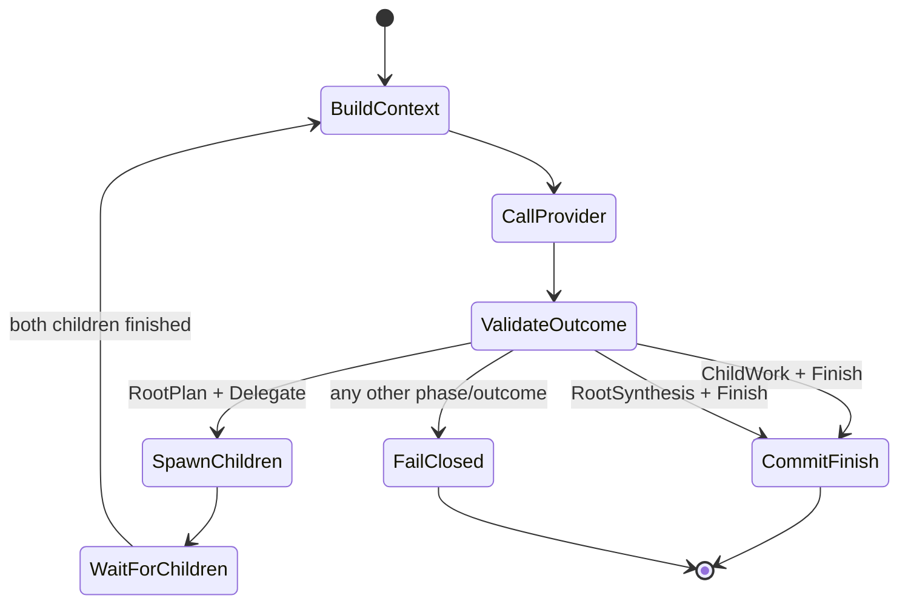

The Engine, not the model, validates the phase/outcome pair. A worker cannot turn model text into permission to delegate. A root cannot declare success before its children reach valid terminal states.

## 8. Durable truth and replay

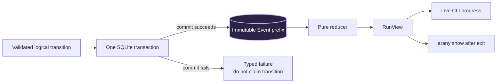

The beta persists one strict Events table with five Event kinds:

- `RunStarted`
- `AgentSpawned`
- `AgentUpdated`
- `AgentFinished`
- `RunFinished`

`Run` and `AgentRun` are reconstructed state, not duplicate authoritative tables. Sequence establishes order; timestamps are display data. A crash leaves a valid committed prefix. Replay labels an incomplete prefix `Interrupted`; it does not invent a cancellation or successful completion.

### Why SQLite

SQLite already provides transactions, recovery, constraints, migrations, indexed replay, and inspection without a server. A custom JSONL journal would make Arany own torn-tail recovery, multi-Event atomicity, checksums, locking, durability, indexes, and migrations. PostgreSQL would add an operational service to a local CLI before there is a multi-host or multi-writer requirement.

The beta deliberately uses one SQLite owner thread and rollback journaling. WAL is triggered by an actual concurrent-reader or durable-commit performance problem, not by habit.

## 9. What the user sees

Arany has one feedback truth—the persisted Event stream—and two initial renderings.

| Mode | stdout | stderr |
|---|---|---|
| Human `run` | Final root result only | Append-only committed progress and safe diagnostics |
| Human `show` | Deterministic replayed RunView | Diagnostics only |
| `--jsonl` | One serialized persisted Event per line | Typed diagnostic envelopes only |

Illustrative human transcript:

```text
$ arany run "Review the architecture risks" --include CONTEXT.md
run 019... started
root 019... planning
worker A 019.../a spawned: review state and recovery
worker B 019.../b spawned: review authority boundaries
worker A 019... running
worker B 019... running
worker B 019.../b finished: authority findings ready
root 019... waiting: 1 worker [019.../a]
worker A 019.../a finished: recovery findings ready
root 019... synthesizing
root 019... finished
run 019... finished: sequence 12; calls 4/4; replay with `arany show 019...`

The three highest-risk decisions are ...
```

The progress lines above go to stderr; only the final paragraph goes to stdout. There are no spinners, cursor rewrites, hidden TTY branches, raw mode, ANSI supplied by a model, or token-by-token output in the beta.

### Feedback information model

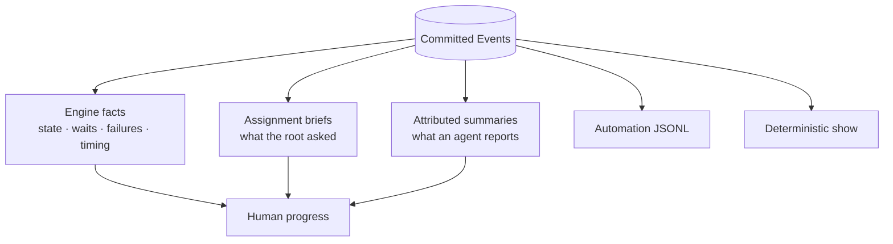

Arany never calls hidden chain-of-thought “feedback.” It shows Engine facts, bounded assignment briefs, and explicitly attributed agent summaries. A future richer client may add a team overview, supervision tree, assignment graph, timeline, and attention inbox, but all remain projections of the same Events.

### Patterns reused instead of reinvented

The [cross-harness comparison](../research/cli-user-feedback-patterns-from-agent-harnesses.md) recommends a deliberately conservative blend:

| Reuse | Arany form |
|---|---|
| Codex's clean human stream split | Final root answer on stdout; progress and diagnostics on stderr |
| Codex, Claude, OpenCode, Gemini, and goose structured event ideas | JSONL is the persisted Arany Event envelope, not a second protocol |
| Claude's causal worker correlation | Every worker Event identifies its parent and assignment cause |
| Gemini's compact lifecycle and exit contract | Typed states and four stable process exit classes |
| goose's concise inline subagent attribution | Trusted `worker A`/`worker B` labels plus shortened typed IDs |
| Aider's humane interruption and actionable recovery | Safe cancellation, preserved completed work, and an exact replay hint |

Arany adapts session resume into read-only replay and interactive worker panels into append-only transitions. It rejects model-token streaming, raw reasoning, TTY-dependent bytes, peer mailboxes, mutable task lists, blanket approvals, rewind/auto-commit, and telemetry as product truth.

### Four Arany-specific improvements

1. **Durable stream receipt:** the terminal Run Event includes the Run ID and last committed sequence so a consumer can detect a truncated pipe and recover with `arany show`.
2. **Causal join feedback:** a wait Event names the outstanding worker IDs, and a worker terminal Event identifies which branch satisfied or broke the join.
3. **Three-part terminal accounting:** the terminal summary separates outcome, usage, and recovery. Usage states its provenance and never fabricates currency cost.
4. **Explicit partial-result ledger:** failure and cancellation still produce one durable terminal status per worker, preventing a successful sibling from hiding an incomplete team.

## 10. Repository instructions and authority

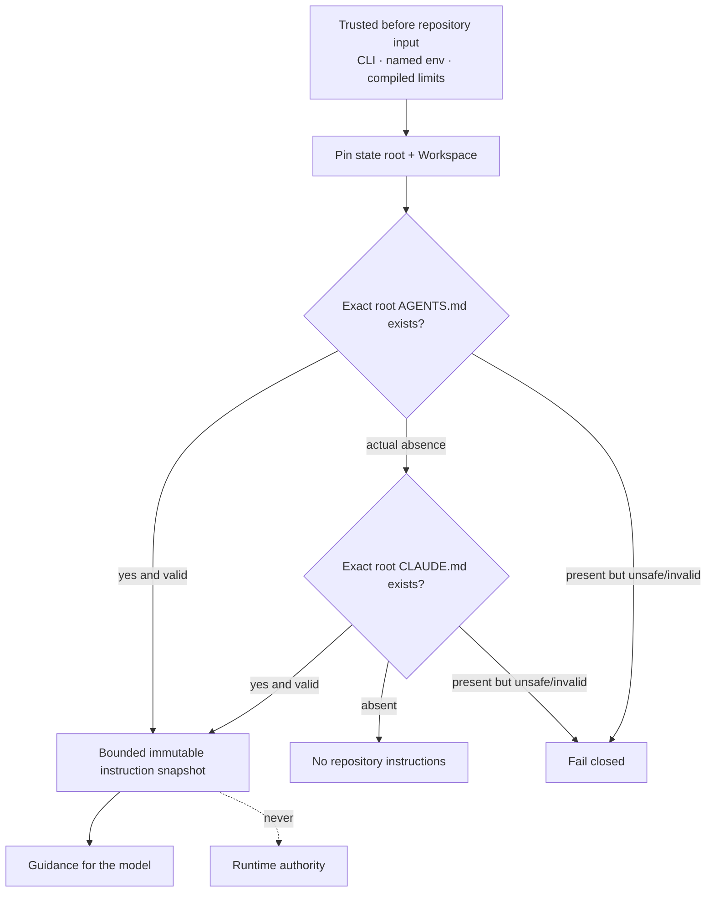

The beta performs no recursive discovery, imports, aliases, project config execution, `.env` loading, Git-hook discovery, plugin loading, or package-manager startup. It rejects symlink/reparse traversal and reads an opened file once into bounded immutable bytes.

The critical distinction is:

- Markdown can influence model guidance.
- Typed Engine and future Policy rules determine authority.
- Guidance cannot widen Workspace, egress, budget, topology, credentials, or capabilities.

## 11. Security today and when Tools arrive

### Beta boundary

The read-only beta permits bounded Workspace reads, fixed Provider egress, private local state, inert output, and optional loopback telemetry. It has no model-driven filesystem write, shell, subprocess, arbitrary network fetch, MCP server, runtime plugin, or callback listener. Therefore it makes no sandbox claim.

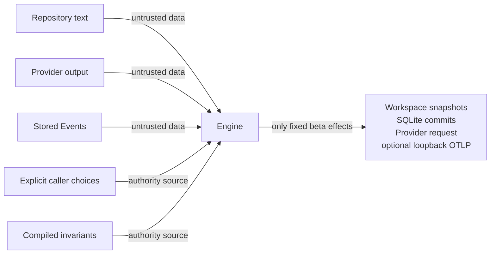

### Future effect boundary

The first effectful Tool changes the architecture. At that point Arany must add a deterministic restrict-only Policy and a separately privileged Guard before shipping the Tool.

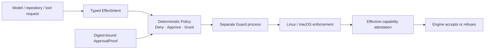

Command-name detection, regexes, model classification, prompts, and approval dialogs are useful aids but not enforcement. An optional AI adviser such as Jev may explain or recommend a narrower profile; it can never widen the deterministic grant.

## 12. Context, Memory, and Artifacts

These terms must remain separate even though only bounded working context exists in the beta.

| Data product | Meaning | Beta status |
|---|---|---|
| Canonical Events | Accepted execution facts | Implemented first |
| Working state | RunView reduced from Events | Implemented first |
| Working context | Bounded input for one Provider call | Private Engine implementation |
| Durable Memory | Scoped, provenance-bearing knowledge reused by later Runs | Deferred until a cross-Run need and retrieval evaluation |
| Artifacts | Large immutable content outside hot Event rows | Deferred until Event/input limits are exceeded |
| Derived data | Summaries, snapshots, indexes, embeddings, caches | Disposable and trigger-based |

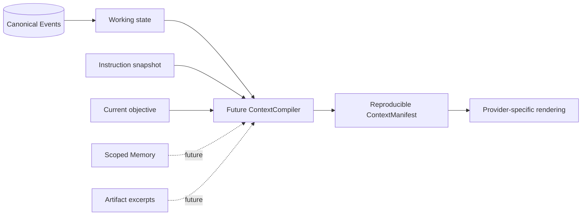

Prompt caching is an optimization behind the Provider adapter, not Memory. Provider conversation state is not canonical history. Vector search arrives only after labelled evaluation shows that scoped lexical retrieval is insufficient.

## 13. Optional OTLP observability

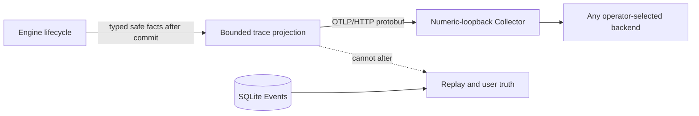

OTLP is an optional second beta patch after the core Run/replay/cancellation proof. It exports traces only. Objectives, prompts, instructions, summaries, results, paths, file contents, Event payloads, provider bodies, headers, and credentials are excluded by type. Telemetry may drop or fail without changing an already-started Run's result or exit status.

The local Collector owns remote TLS, authentication, retry, vendor routing, and secrets. Arany initially accepts only an explicit numeric-loopback Collector endpoint; it does not become a generic network client.

## 14. Testing as product evidence

The goal is not a large test count. Each admitted test must protect a visible contract, durable/security invariant, protocol boundary, concurrency/failure mode, or demonstrated regression.

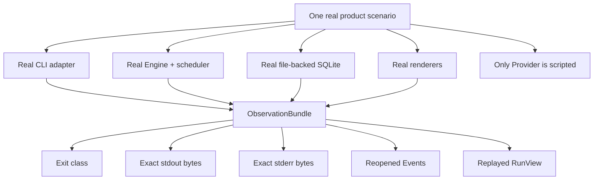

The central deterministic journey proves the four-call team, reverse worker completion, join behavior, commit-before-feedback, replay, and user-visible output. Compact tables/corpora own path, security, boundary, and output cases. Failpoint loops own crash/disk/store failures. A small real-process table owns parsing, channels, exit codes, signals, and `show`. One ignored paid OpenAI smoke proves the live adapter path.

Default tests are offline, deterministic, retry-free, free of wall sleeps, and native on both Linux and macOS before beta support is claimed.

## 15. How modularity grows without a rewrite

The beta calls the Engine in-process. The Engine's conceptual boundary already keeps terminal details outside, but Arany does not create a daemon or process protocol until there is a second client or detached execution.

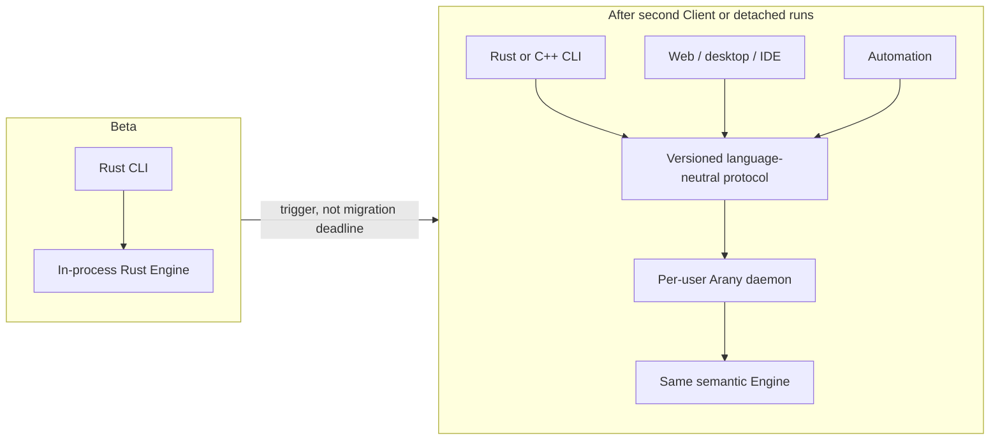

A future C++ CLI should normally speak the language-neutral process protocol rather than link to unstable Rust ABI types. UI technology can change without moving lifecycle, security, persistence, or Provider semantics out of the Engine.

## 16. Roadmap by trigger

| Trigger observed | Add then | Do not add before |
|---|---|---|
| Core scripted team, replay, and cancellation pass | OpenAI adapter, then optional OTLP | Live complexity before deterministic proof |
| First effectful Tool | `EffectIntent`, Policy, approval binding, separate Guard, containment evidence | Shell/MCP/process execution |
| Agents need concurrent writes | Isolated Workspace views and one integration owner | Shared mutable checkout |
| Work has dependencies or ownership transfer | Assignment DAG, attempts, joins, leases, fencing | Generic scheduler platform |
| Follow-up objectives need one durable conversation | Session | Session tables for one-shot Runs |
| Later Runs benefit from saved knowledge | Scoped Memory plus retrieval/deletion evaluation | Autonomous “remember everything” |
| Event payload limits are exceeded | Content-addressed Artifacts | Blob-heavy Event rows |
| Replay misses a measured budget | Rebuildable snapshots | Snapshot machinery |
| Lexical retrieval is needed | FTS5-derived index | Embeddings/vector database |
| Labelled evaluation proves lexical quality insufficient | Vector or hybrid index | Trend-driven vector infrastructure |
| Second client or detached execution exists | Daemon and versioned process protocol | Speculative server |
| OpenAI blocks required behavior | Another hosted Provider adapter | Provider abstraction marketplace |
| A real client needs partial output | Bounded streaming and partial-output semantics | Token streaming by default |
| Repeated trials need release statistics | Evaluation runner, datasets, graders, baselines | Eval service in the beta |
| Terminal measurements justify richer interaction | TTY renderer over RunView | Full-screen TUI |
| Hosted or multi-tenant product exists | New identity, authorization, retention, quota, encryption, and threat model | Reusing local trust assumptions remotely |

## 17. Explicit beta non-goals and non-claims

Arany beta does not contain or claim:

- a web app, full-screen TUI, IDE integration, daemon, or remote API;
- arbitrary agent hierarchies, peer negotiation, handoffs, or detached workers;
- model-driven Tools, shell access, MCP, plugins, or filesystem writes;
- deterministic protection of effects that do not yet exist;
- cross-Run Memory, vector retrieval, Artifacts, snapshots, or evaluation services;
- multiple production Providers, routing, automatic fallback, or automatic retry;
- Windows support;
- encryption at rest or protection from the current OS account, compromised host, or Provider;
- multi-user or multi-tenant isolation;
- exact cost enforcement after an external request is in flight; or
- proof that local overhead is negligible before measurements exist.

## 18. Decisions for human review

The architecture is internally coherent enough to implement, but these product choices are worth reviewing before the plan is written:

1. **Feedback density:** does the recommendation feel right—one line per committed semantic transition, including explicit causal wait changes, but no periodic timer noise?
2. **Assignment visibility:** is a bounded one-line worker brief enough by default, with fuller typed history available through `show`?
3. **OTLP timing:** should optional OTLP ship in the beta after the core proof, or wait for the first external operator request?
4. **License:** which exact license expresses “free with author attribution”—for example MIT, Apache-2.0, or a deliberate dual license?
5. **Fixed proof topology:** is exactly two workers the right first proof, knowing that configurable team size remains a later measured feature?

## 19. Detailed evidence

This map summarizes rather than duplicates the full arguments:

- [Canonical minimum architecture](./system-overview.md)
- [Decision register](../research/next-step-decision-register.md)
- [Patterns worth reusing from existing harnesses](../research/cli-user-feedback-patterns-from-agent-harnesses.md)
- [Rust core feasibility](../research/rust-core-feasibility.md)
- [Modular architecture](../research/modular-harness-architecture.md)
- [Multi-agent loop and feedback](../research/multi-agent-loop-and-user-feedback.md)
- [Agent-state persistence](../research/agent-state-persistence.md)
- [Context, Memory, and compaction](../research/context-memory-and-compaction.md)
- [Instruction Markdown and Policy](../research/instruction-markdown-and-policy-enforcement.md)
- [Deterministic protection](../research/deterministic-harness-protection.md)
- [Provider and Tool runtime](../research/provider-and-tool-runtime.md)
- [Security lessons and controls](../research/harness-security-lessons-and-controls.md)
- [Testing strategy](../research/testing-strategy-for-rust-cli-harness.md)
- [OTLP observability](../research/otlp-observability.md)
