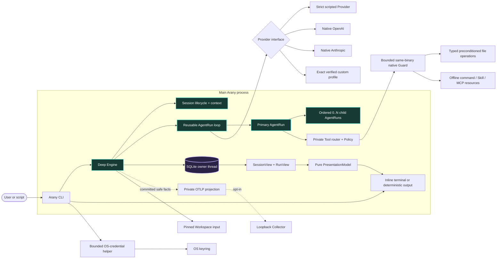

# Arany beta architecture

**Status:** canonical first implementation  
**Date:** 2026-10-06
**Design rule:** build a familiar durable harness, then deepen it without replacing its Engine

This document owns physical architecture, data model and responsibility boundaries. [Product specs](../specs/README.md) own migrated observable contracts; other domains retain their existing module contracts. [The documentation map](../README.md) locates those owners, and [next steps](../../NEXT_STEPS.md) owns current defects and verification debt. Research and the [decision register](../research/next-step-decision-register.md) retain source evidence and rationale. Anything absent here is not an empty module waiting to be scaffolded.

## 1. What the beta must prove

Arany is an interactive Session-oriented CLI, not a one-shot team demo. Bare `arany` creates a durable Session; every submitted user Message starts one bounded Run; each Run has one accountable primary AgentRun and may admit `0..N` direct read-only children.

The full product contract is successful when it proves all of these together:

1. a Session survives process exit, explicit resume, multiple Runs, provider changes between Runs, compaction, and deterministic replay;
2. `single`, `auto`, and `team` policies all use the same reusable loop and a generic ordered child collection rather than a fixed two-worker shape;
3. the primary cannot finish team work before every required child has a persisted terminal disposition;
4. the default terminal keeps a navigable committed transcript in the primary screen, conditional agent activity above a fixed-bottom composer, and a compact status row below input;
5. keyboard access is complete, while mouse reporting exists only transiently inside an open picker or detail panel;
6. native OpenAI and Anthropic plus every admitted exact custom endpoint/model profile satisfy the same semantic Provider contract;
7. exact Workspace-root `AGENTS.md` loads first, with exact `CLAUDE.md` as absence-only fallback;
8. `exec` and `show` expose the same committed facts without terminal initialization; and
9. cancellation reaches the primary and every admitted child without fabricating completion; and
10. explicitly enabled primary Tools use typed one-use intents, restrict-only Policy, native Guard enforcement, bounded continuation and durable non-executing replay.

The current personal beta 1 implementation milestone is narrower: build a local Linux executable and complete the current OS user's ChatGPT account, model/effort, durable Engine and chat flows, plus an explicitly enabled local coding foundation for guarded file operations, offline commands, progressive Skills and stdio MCP. Automated synthetic evidence owns these implementation claims. Real sign-in, plan-consuming turns/tool loops, remaining native credential checks, and manual UX/accessibility testing belong to the final user handoff; they do not block implementation and remain unverified support claims until performed. The broader contract above is not a claim that beta 1 has cross-platform or redistribution evidence. Native macOS validation, portable distribution, and additional performance gates follow after beta 1; the [decision register](../research/next-step-decision-register.md) records the scope and Anthropic subscription authorization boundary.

Startup resolves trusted user/process configuration, admits a private state root outside the Workspace, selects one ProviderProfile, and pins the caller-selected Workspace before consuming project-controlled input. Admission never executes or discovers Git/repository configuration, `.env`, hooks, plugins, packages, tests, or startup commands. Instruction and explicit include files remain bounded immutable no-follow snapshots. Default Runs are read-only; `--tools` adds only the private host-approved grant and separately enforcing Linux Guard described in [local tools](../tools.md). Unsupported native enforcement fails closed. Live tool-capable model and native macOS claims remain unverified.

## 2. Runtime architecture

There is one Rust package, one long-lived process, and one substitutable Engine behavior seam. Short-lived same-binary children isolate blocking OS-credential calls and effectful Tool execution at separate privilege boundaries; neither is a second Client or daemon.



Provider is the only substitutable Engine behavior because several implementations exist at release. Scheduling, Session/context compilation, SQLite, replay, Workspace input, reducers, terminal presentation, and telemetry are private Engine responsibilities. Native OpenAI and Anthropic are supported adapters. A custom profile is admitted only for one exact protocol/origin/model/capability-evidence tuple. A built-in constrained OpenRouter profile is deferred until its broker-route and privacy gates pass; Z.AI is not admitted while it lacks the required strict outcome contract.

The current-thread Tokio coordinator owns async lifecycle. One named standard-library thread owns the sole synchronous SQLite connection. A bounded telemetry worker owns OTLP export. Neither storage nor telemetry blocks Provider progress on the coordinator.

## 3. Physical beta shape

```text
Cargo.toml
src/
├── main.rs          CLI grammar, mode selection, exit mapping
├── cli.rs           shared CLI output and state-path selection
├── cli/
│   ├── attached.rs  attached Session lifecycle and composer loop
│   ├── attached/
│   │   ├── active.rs    active Run and compaction terminal handling
│   │   ├── agents.rs    agent inspector command handling
│   │   ├── controls.rs  trusted local command handlers
│   │   ├── picker.rs    private Session picker input and selection
│   │   ├── models.rs    bounded attached model catalog browsing
│   │   ├── run.rs       selected native Provider Run composition
│   │   └── setup.rs     attached account selection
│   ├── chatgpt.rs  consented OAuth account access and selected catalog
│   ├── chatgpt/
│   │   ├── account.rs  bounded protected subscription account records
│   │   ├── account/
│   │   │   └── tests.rs synthetic renewal and storage cases
│   │   ├── callback.rs bounded one-result loopback HTTP callback
│   │   ├── catalog.rs  bounded account-scoped subscription model listing
│   │   ├── consent.rs  versioned account-bound warning acceptance
│   │   ├── exchange.rs bounded token/JWKS redemption
│   │   ├── exchange/
│   │   │   ├── revoke.rs private discovered-endpoint token revocation
│   │   │   └── tests.rs synthetic issuer and signed-identity corpus
│   │   ├── identity.rs strict signed ID-token admission
│   │   └── registration.rs stable host and issued-client registration
│   ├── credentials.rs protected default native API account access
│   ├── credentials/
│   │   └── keyring_helper.rs supervised bounded OS-store process
│   ├── exec.rs      one-Run command composition and durable receipt
│   └── provider.rs  model catalog and data-free custom profile check commands
├── lib.rs           small public interface for the deep Engine
├── diagnostics.rs   closed local debug failure stages and bounded stack frames
├── engine.rs        Run admission, budgets, Provider outcomes
├── engine/
│   ├── compaction.rs private manual and duplicate-safe automatic compaction
│   ├── lifecycle.rs private Session create/resume/fork/default operations
│   ├── progress.rs  committed bounded Run observation
│   ├── run_loop.rs  private Run orchestration and terminal transitions
│   └── run_loop/
│       └── children.rs private bounded child scheduling and synthesis
├── session.rs       Session module interface
├── session/
│   ├── events.rs    typed canonical facts and scope validation
│   ├── reducer.rs   strict Session/Run/AgentRun replay
│   ├── input.rs     pinned no-follow Workspace snapshots
│   ├── input/
│   │   └── race_tests.rs ignored Linux component-replacement gate
│   ├── context.rs   deterministic bounded history selection
│   ├── lineage.rs   canonical Event-prefix digest for fork replay
│   └── compaction.rs bounded summary input and snapshot validation
├── provider.rs      Provider semantic contract and adapter selection
├── provider/
│   ├── custom.rs     private exact custom-profile admission
│   ├── custom/
│   │   ├── adapter.rs      verified semantic custom Provider
│   │   ├── destination.rs  bounded resolution and pinned HTTP destination
│   │   ├── check.rs        synthetic conformance and evidence orchestration
│   │   └── transport.rs    shared bounded custom wire and egress
│   ├── anthropic.rs  native Messages key and bounded HTTP behavior
│   ├── anthropic/
│   │   ├── wire.rs  strict Messages documents and decoding
│   │   └── wire/
│   │       └── tests.rs  offline wire corpus
│   ├── effort.rs     reviewed native model-specific effort admission
│   ├── image.rs      bounded immutable PNG values and semantic origin
│   ├── catalog.rs    bounded account-scoped native model discovery
│   ├── native_check.rs  exact-key synthetic conformance and evidence admission
│   ├── openai.rs     native Responses key and bounded HTTP behavior
│   └── openai/
│       ├── subscription.rs bounded ChatGPT-plan Provider and synthetic probe
│       ├── subscription/
│       │   └── tests.rs synthetic stream and local-limit corpus
│       ├── wire.rs  strict Responses documents and decoding
│       └── wire/
│           └── tests.rs  offline wire corpus
├── tools.rs         private grant admission and concrete effect router
├── tools/
│   ├── config.rs    private closed configuration and resource pins
│   ├── types.rs     semantic calls, immutable intents and receipts
│   ├── fs.rs        no-follow snapshots and atomic native mutations
│   ├── guard.rs     exact unit/cgroup ownership and helper lifecycle
│   ├── guard/
│   │   └── profile.rs Linux namespace facts and compiled seccomp profile
│   ├── mcp.rs       bounded legacy stdio tools protocol and schema checks
│   ├── skills.rs    bounded portable metadata, inside the Guard only
│   └── tests.rs     deterministic grant/schema/receipt corpus
├── store.rs         private SQLite owner and Store interface
├── store/
│   ├── evidence.rs  bounded expiring custom and native Provider evidence
│   ├── journal.rs   SQLite setup, migration, append, fork writes
│   ├── journal/
│   │   └── crash_tests.rs ignored Linux append transaction-death gate
│   ├── replay.rs    bounded strict Event loading and lineage resolution
│   ├── state.rs     private state-root admission inside the store boundary
│   └── state/
│       └── lock.rs  per-Session and account-replacement locks, private file checks
├── presentation.rs  pure linear projections and sanitization
├── presentation/
│   ├── agents.rs    bounded semantic agent inspection
│   └── model.rs     bounded semantic status and activity rows
├── terminal.rs      attached terminal ownership and lifecycle
├── terminal/
│   ├── agents.rs    agent inspector navigation and state
│   ├── commands.rs  closed trusted slash registry and parser
│   ├── clipboard.rs explicit bounded local OS-client lifecycle
│   ├── composer.rs  bounded grapheme-safe draft editing
│   ├── input.rs     bounded reader ownership and semantic input mapping
│   ├── input/
│   │   └── raw.rs   bounded Unix keys, pointer events and paste framing
│   ├── linear.rs    labeled append-only terminal output
│   ├── view.rs      inline Ratatui frame drawing
│   └── view/
│       └── tests.rs  inline frame and picker TestBackend cases
├── telemetry.rs     private opt-in OTLP trace lifecycle and SDK owner
└── telemetry/
    ├── config.rs    numeric-loopback endpoint admission
    ├── tests.rs     topology, privacy, and transport fixtures
    └── tests/
        └── performance.rs ignored Linux release queue-saturation measurement
tests/
├── session_run.rs   journal, replay, and process-level output
├── session_run/
│   ├── active_terminal.rs Linux signals, cancellation, suspend, and restoration PTYs
│   ├── active_terminal/
│   │   ├── acquisition.rs  Linux partial-acquisition restoration PTY
│   │   ├── broken_stderr.rs Linux active-renderer fault PTY
│   │   ├── panic.rs Linux terminal-owner panic-unwind PTY
│   │   └── output_window.rs Linux signal during restored-output PTY
│   ├── agent_inspector.rs Linux active/idle inspector PTYs
│   ├── auto_compaction.rs Linux attached threshold and compaction process journey
│   ├── custom.rs    exact custom-profile process journey in the same test target
│   ├── disk_fault.rs Linux Store file-growth recovery release gate
│   ├── disk_fault/
│   │   ├── enospc.rs ignored Linux private-tmpfs ENOSPC recovery gate
│   │   ├── enospc/
│   │   │   └── product.rs ignored shipped-exec private-tmpfs ENOSPC gate
│   │   └── product.rs ignored Linux shipped-exec failure-channel gate
│   ├── live.rs      ignored paid native direct/team conformance journeys
│   ├── loopback.rs  shared bounded local Provider process fixture
│   ├── performance.rs ignored Linux release replay and team process measurements
│   ├── performance/
│   │   ├── memory.rs  ignored Linux two-file and capped-response RSS measurement
│   │   └── startup.rs ignored two-file startup upper-bound measurement
│   ├── session_picker.rs Linux transient mouse-capture picker PTY
│   ├── session_picker/
│   │   └── termination.rs Linux picker signal and suspend restoration PTY
│   ├── slash_completion.rs Linux Tab, ghost placeholder, and restoration PTY
│   ├── setup.rs    Linux hidden-key cancellation and terminal restoration PTY
│   ├── startup_trust.rs Linux adversarial repository-startup process gate
│   ├── tools.rs     native effect journey, hostile peers, quotas and replay
│   ├── tools/
│   │   └── native_exec.rs shipped native-adapter command continuation over local TLS
│   └── telemetry.rs product-process trace and canonical replay journey
├── common/
│   └── process.rs   bounded concurrent product-output capture including exit/EOF
├── engine_run.rs   scripted Provider and Workspace input journey
└── engine_run/
    ├── performance.rs ignored release two-child core Run measurement
    ├── workspace_security.rs explicit include admission corpus
    └── performance/
        └── cancellation.rs ignored release team cancellation measurement
```

This remains one package and one long-lived process. OS credentials use a supervised same-binary helper; explicitly requested clipboard access uses a bounded trusted OS-client child under terminal ownership. Neither becomes an agent Tool. The private `tools` implementation is one concrete router with deterministic Policy and a native Guard privilege seam, not a generic execution framework or fakeable second Engine behavior seam. The `session/` files remain one deep module, and ChatGPT's stream remains private OpenAI implementation. `engine.rs` holds orchestration behind `Engine::run`, keeping `lib.rs` readable. Add a crate only after measured release, privilege, ownership, dependency or compile pressure.

## 4. Public command contract

[The terminal spec](../specs/terminal.md#entry-modes-and-channels) owns attached entry, interactive controls, deterministic channels and their acceptance scenarios. [Account setup](../setup.md) and [local tools](../tools.md) are user procedures; the compiled CLI/command registry owns exact syntax. [CLI rules](../../agents/cli.md) own admission ordering, typed error classification and command-specific composition.

`main.rs` selects attached chat, setup, `exec`, `show` or Provider operations. Private CLI callers resolve trusted inputs and call Engine operations; they do not implement Run transitions or wire decoding. Session entry delegates create/continue/resume/fork to the Engine, which revalidates the pinned Workspace and canonical lineage. Headless `exec` creates one Run in a new Session by default; append requires an explicit Session ID. `show` uses strict read-only replay. There is no `run` alias.

The attached composer, slash handlers and quick selector share the compiled local controls and existing defaults/admission owners. Provider selection, saved-account identity, billing-route choice, catalog discovery and Run authority remain separate operations. Typed busy/defaults rejection can recover in chat, while State/replay/terminal failures retain their fatal boundary. A failed operation is not a rollback or retry grant.

Explicit `--tools` reaches the same private Engine/Policy/Guard admission from attached and headless composition. The CLI supplies the shipped executable identity and private configuration root, not an alternative Tool runtime or per-effect approval service.

## 5. Session, Run, and collaboration lifecycle

The lifecycle hierarchy is:

```text
Session
├── durable messages, title, fork lineage, defaults, compaction snapshots
└── Runs[] in committed order
    └── Run
        ├── pinned ProviderProfile/model/policies/budgets
        └── AgentRuns[]
            ├── one primary
            └── ordered 0..N direct children
```

A Session has at most one active Run in beta. The Engine holds a private per-Session state lock across each Run, source fork, and manual compaction; a brief private namespace lock coordinates file creation and removal while other Sessions can proceed independently during work. At most 65,536 Session lock files may exist, including crash-stranded pre-commit files. Completed, failed, cancelled, and interrupted Runs remain immutable history. Resume reconstructs the same Session; fork creates a new Session with a single `SessionForked` first Event recording source Session, boundary Run, boundary sequence, and canonical Event-prefix digest. Store replay validates bounded source ancestry; the context compiler selects successful inherited turns only through that boundary. Historical children remain inspectable but are never recreated as live work.

Before each Run, Arany pins one collaboration policy:

```text
single
  maximum active children = 0

auto(max_active_children = N)
  primary may delegate only when independent work is useful

team(max_active_children = N)
  primary must propose a non-empty team decomposition
```

The product default is `auto` with at most three active children. `N` is a numeric input, not a compiled topology, but spawning is always bounded. Effective capacity is the minimum of the Session policy, a process safety ceiling, remaining call/token/byte/time budgets, and Provider concurrency. Children cannot create nested teams in beta.

The semantic Provider outcome is:

- `Finish { summary, result }`;
- `Delegate { children: bounded ordered objectives }`; or
- explicitly enabled primary-only `Tool { call: closed typed operation }`.

In `single`, the primary finishes without delegating. In `auto`, it may finish directly or delegate. In `team`, its first non-Tool outcome must be a nonempty bounded delegation. Every child is still one-call read-only reasoning; after all required children finish, primary synthesis may use the same remaining Tool budget before finishing. Without Tools, a successful team with `k` children uses `k + 2` Provider calls and a direct answer uses one. Enabled Tools add at most 16 shared continuations to that bounded topology; their context is reserved before effects. Reported input usage above 1,000,000 tokens or output usage above the exact request cap fails at each public production adapter, including standalone library calls; Engine validation remains defense in depth. Native OpenAI can retain unknown usage, while exact custom transport requires positive reported usage. No automatic retries or cross-provider fallbacks exist.

Context is isolated per AgentRun. Children receive explicit assignment capsules and narrower-or-equal authority, never a shared mutable prompt. Only the primary writes the final assistant Message.

## 6. Context and compaction

### Local effect ownership

The [coding-base plan](../../planning/effectful-beta-base/README.md) records the 2026-10-04 scope, alternatives, threat model and verification owners. `tools.json` is private host configuration, not repository configuration. Its pinned scope/resource digests produce immutable primary-only one-use intents. The Engine commits each Provider request fact and intent before dispatch, then a correlated observation before inferring again. Uncertain, cancelled or unacknowledged effects stop without retry; public typed replay validates payloads as well as legal transitions. Old journals remain readable without gaining grants.

The Linux Guard verifies namespace/capability/seccomp and effective cgroup limits before payload release, owns the exact invocation and retained cgroup through cleanup, and reports a digest-bound receipt. Native operations use live no-follow handles and digest/create-preconditioned fresh-inode replacements. Commands/MCP instead receive fresh private selected-file snapshots, no network or accounts and bounded memory/PID/CPU/time/scratch; subprocess changes are discarded. Skills are pinned progressive guidance/resources, never permissions. YAML/schema work occurs only inside this killable boundary. MCP supports exactly the 2025-11-25 local stdio tools profile, with bounded negotiation/catalog/schema/framing/calls and no automatic retries. [The tool guide](../tools.md) owns the supported subset and setup, not a claim of arbitrary build/runtime compatibility.

Past effect records enter context/compaction only as bounded untrusted facts, including interrupted attempts and observed failures, never renewed permission or execution. The tool-enabled compiler reserves current observations from the existing context budget. Its source-pressure guard additionally accounts for maximal Tool history so maintained conversation can compact before the unchanged source cap. Read-only children receive none of the Tool catalog or observations.

### Conversation context

Session history is local canonical state. Provider conversation IDs, cache keys, and opaque compaction items are optional accelerators.

The deterministic context compiler selects trusted instructions, the current user Message, bounded recent Session history, valid compaction material, explicit include snapshots, and required child results under the chosen Provider's exact budget. It records what was included and excluded. Provider switching between Runs recompiles from Arany state.

Provider-neutral textual compaction uses the Provider's separate semantic `compact` operation rather than inventing an AgentRun. Accepted conversation outcomes, including unanswered objectives, and an optional prior summary enter that call; the model-authored result remains untrusted derived data. A later `RunStarted` pins the selected snapshot Event and content digest.

Compaction never replaces or deletes canonical history. `/compact` creates a derived snapshot for an exact committed Session prefix and records:

- covered Run/sequence and source digest;
- Provider, model, prompt/schema/compiler versions;
- bounded summary or compatible opaque Provider item;
- byte/token estimates and content digest; and
- completion/failure provenance.

Manual compaction runs only while idle and makes its Provider usage visible. Each new `RunStarted` records actual selected context-content bytes, its compactable Session-history share, and the policy-adjusted byte budget. After a successful attached Run reaches 80% of that budget with at least 10% compactable history, 24 of the 32 selectable history Runs, or the separate source-pressure threshold, Arany prints a durable warning after the confirmed receipt, then attempts automatic compaction for that exact committed boundary using the Run's pinned Provider/model/effort and account source. The source guard reserves two maximal canonical turns below the independent 256-KiB compaction-input cap, accounting for the pre-reply footprint and the previous unchecked turn; canonical Message and image-metadata limits have shared owners. Continuously maintained successful conversations can therefore compact before their source grows beyond the call's bound. This does not recover every unmaintained or failure-heavy prefix; oversized source still rejects before egress. The private CLI passes the committed config rather than mixing its tuple with newer Session defaults; an absent saved account remains the original environment-backed/custom source, while a recorded API or ChatGPT account is re-admitted by identity and current evidence. Replay grants no credential authority. A large immutable Workspace input alone cannot trigger a call that would not relieve pressure. The Engine checks the expected Run ID and prior attempts under the Session lock, so a stale warning or concurrent compaction does not spend another call for that boundary. Compaction composition separates safe operation failures and explicit interruption from terminal-owner errors: committed/admission failures receive labeled chat feedback, interruption warns about uncertain commitment, and terminal failure propagates to restoration and exit. None changes the already confirmed Run outcome or automatically retries. `exec` makes no hidden post-Run Provider call. Failure leaves the Session intact; an incompatible or digest-mismatched snapshot is ignored with a typed failure. Cross-Session Memory remains deferred and distinct.

## 7. Canonical persistence

One strict SQLite Event journal remains product truth. Session, Run, AgentRun, SessionView, and RunView are reduced state rather than duplicate authoritative tables.

```sql
CREATE TABLE events (
    sequence       INTEGER PRIMARY KEY,
    session_id     TEXT NOT NULL,
    run_id         TEXT,
    agent_run_id   TEXT,
    kind           TEXT NOT NULL,
    event_version  INTEGER NOT NULL CHECK (event_version >= 1),
    payload        TEXT NOT NULL CHECK (json_valid(payload)),
    created_at_ms  INTEGER NOT NULL
) STRICT;

CREATE INDEX events_by_session ON events (session_id, sequence);
CREATE INDEX events_by_run ON events (run_id, sequence) WHERE run_id IS NOT NULL;
```

The initial vocabulary is intentionally small:

- `SessionStarted`, `SessionRenamed`, `SessionDefaultChanged`, `SessionForked`, `ContextCompacted`;
- `MessageAccepted`, `MessageCommitted`;
- `RunStarted`, `RunFinished`;
- `AgentSpawned`, `ProviderCallRecorded`, `AgentFinished`; and
- `ToolStarted`, `ToolFinished`.

Tool Events use payload version 1 and correlate the exact Run, primary actor, one-use intent, pinned policy/enforcement digest, Workspace identity and finite effective limits. A successful observation requires a matching Guard receipt. Unknown, duplicated, unmatched, over-budget or mismatched transitions reject; uncertainty/cancellation cannot be followed by successful Agent completion. Public typed replay validates payloads as well as SQL loading. A started attempt without a terminal observation remains a past interrupted/uncertain fact, never an approval or retry instruction.

New `SessionStarted` Events use payload version 2 to pin the admitted Workspace device and inode atomically with the title, including for an empty Session. Version 1 title-only Events remain readable; their Workspace identity is established by the first `RunStarted` if one exists. Replay rejects a later Run or fork whose identity disagrees with the pinned Session. Legacy empty Sessions cannot be selected by Workspace until a Run binds them.

Provider/profile, collaboration policy, limits, instruction digest, and Workspace snapshot facts are fixed in `RunStarted`. Each observed Run call then records its phase, local disposition, bounded response ID, provider-reported token usage, and accepted wire provenance when available before the relevant AgentRun finishes. Compaction records carry the same optional wire provenance. The closed values distinguish Responses `completed` plus a local `store: false` request from Messages `end_turn` with no equivalent request switch; they do not assert remote retention, account-level Zero Data Retention, or a custom endpoint's compliance. A cancelled or timed-out call has unknown usage and wire provenance, not zero; cancelling the Run after a call has returned preserves its observed record and any known usage. Sticky cancellation wins before either successful or failed primary terminal commitment starts, without rewriting earlier child outcomes. Once that commitment starts, it completes or leaves an interrupted prefix on Store failure. Replay checks call order and accepts older journals with no call records or provenance. A logical transition commits before reduction or feedback. A crash leaves a valid prefix; replay labels incomplete work `Interrupted` rather than inventing cancellation or success.

Recognized typed Provider failures retain an optional closed reason for account access, usage limits, temporary usage or service unavailability, stream protocol, response contract, structured outcome contract or local output acceptance. Only records with a reason use `ProviderCallRecorded` payload version 2; generic calls retain version 1, and both replay without a database-schema change. Strict admission rejects a reason inconsistent with its disposition or version. Raw HTTP status, stream code, upstream text/body and request IDs are excluded. Chat feedback and agent details translate the last call of a failed AgentRun into compiled recovery guidance; cancelled siblings and successful calls cannot supply its cause. Linear modes append the same feedback after their confirmed receipt. This metadata does not enter Provider context or traces, prove a billing diagnosis, trigger retry or switch account routes. Compaction keeps its separate existing failure categories.

Idle rename/default changes may follow an interrupted prefix without submitting another objective. Their committed Session-only facts seal the unfinished predecessor, preserve its observations and prevent later transitions under that abandoned Run ID. The [Session reducer contract](../../agents/session.md#persistence-and-proof) owns this recovery rule; lifecycle operations hold the existing per-Session lock to exclude a live Run. No interruption Event or synthetic terminal outcome is added, and fork/compaction still require their existing committed boundary.

Before Run effects or Provider usage, the Store strictly checks the resolved lineage count plus the complete worst-case lifecycle/children/Tool Event envelope in an immediate transaction. Its database byte preflight covers each slot's maximum ordinary payload and bounded SQLite page/index overhead, one larger image Message, and the unchanged per-append floor; the floor alone cannot fund the later receipt/closure writes. Engine retains operation locks for the Session and all ancestors because replay counts their full journals, including suffixes outside a fork boundary. Compaction additionally checks its direct Session's lifetime attempt quota; inherited summaries do not charge that quota. Finish admission measures the exact serialized terminal payload, not only raw text. Event-count admission is stabilized by those locks; the byte allowance is a conservative preflight, not a lease against concurrent independent writers or a physical disk reservation. Disk faults and process death still require interrupted/uncertain recovery. Independent lineages remain concurrent.

The sole connection opens no-follow in a private owner-verified local state directory, uses defensive mode, rollback `DELETE + EXTRA`, `trusted_schema=OFF`, bounded pages, short transactions, and fixed payload limits. Rebuildable indexes may accelerate Session listing; they never become canonical.

## 8. Terminal presentation

[The terminal spec](../specs/terminal.md) owns modes, layout, keys, draft retention, selectors, setup presentation, paste, accessibility, process channels and acceptance scenarios. [Terminal](../../agents/terminal.md), [history](../../agents/history.md), [clipboard](../../agents/clipboard.md) and [image](../../agents/image.md) rules own their implementation invariants.

`presentation.rs` maps committed SessionView/RunView facts to bounded semantic rows and append-only lines. The private terminal module owns the primary-screen viewport, Composer, history index, raw/canonical readers, keys, focus, mouse and one RAII lifecycle owner. None of these presentation types enters the Engine.

History indexes row counts/source anchors over the already loaded Session view without retaining another full transcript, and materializes only visible message rows. Terminal-local feedback interleaves with those rows but has no canonical or Provider-context authority. The Composer owns the bounded Provider/account-scoped catalog and draft; the CLI's picker owns its cancellable refresh and staged default publication.

The private attached model owner persists token-free `model-preferences.json` under the checked OS-user account root, using the existing account replacement lock and atomic file transport. It holds at most eight exact Provider/account UUID sources, their selected model/effort and up to 4,096 catalog IDs each, bounded to 1 MiB with oldest-source eviction. Current native metadata reconstructs labels; the file contains no compatibility evidence, grant or credential. New bare Sessions reuse matching preferences and seed the Composer cache; explicit flags and resumed defaults win. A first upgrade may copy only a matching tuple from the latest admitted-Workspace Session without inheriting its history. Selection and successful catalog writes remain separate from current account/consent and actual-response admission.

The Engine publishes the latest acknowledged RunView and committed sequence through a one-slot coalescing progress handle. Skipped display intermediates never skip canonical Events. Before Engine admission, preparing feedback remains presentation-local; afterward activity derives solely from committed current-Run facts. Closed replay, terminal restoration and typed CLI classification precede receipt/answer output.

A terminal-owned clipboard worker has bounded trusted OS-client ownership distinct from the reader and Engine. Immutable image values cross semantic Provider/Session boundaries; human drawing receives metadata. Canonical image bytes, multimodal context and compaction remain under the image/Session/Store owners.

The released terminal owner retains signal listeners through committed output and transfers them to reacquisition. Raw/canonical input is stopped and joined before modes/flags are restored; suspension retains the pinned Run future and bounded draft. Lifecycle failures cannot manufacture a committed outcome. Detailed fault ownership and current unverified claims remain in [next steps](../../NEXT_STEPS.md) and [the beta evidence plan](../../planning/arany-beta/README.md).

## 9. Provider profiles and custom endpoints

One ProviderProfile binds protocol family, normalized endpoint/base path, credential reference, model, outcome encoding, privacy claim, and capability evidence. Native profiles are compiled; each admitted model still requires paid model-scoped live proof before a release claim. Custom profiles live only in trusted user configuration outside the Workspace.

Native API selection carries one closed credential value: Provider, key and optional Anthropic API workspace. The API workspace is a tenant/billing scope, not Arany's filesystem Workspace. Environment-backed Anthropic selections read it explicitly; other Providers and saved accounts never inherit it. Setup offers key-scoped access or a visible explicit workspace ID. Key-only accounts keep schema 1; a scoped Anthropic account requires schema 2, while the backend marker and aggregate storage cap stay unchanged. The selected-account loader returns the complete validated credential. Its scope is immutable across catalog pages and all native calls and enters the current exact-evidence fingerprint. It authorizes no new endpoint or arbitrary header. The [beta plan](../../planning/arany-beta/README.md#completed-implementation-explicit-anthropic-api-workspace-scope) records the implementation and evidence scope; synthetic success is not live API compatibility.

Native model effort is selected from a reviewed per-model set or resolved to an explicit reviewed default before Workspace input. The native adapter sends the resolved level explicitly on every Run and compaction request, and `RunStarted` pins it for replay. The finite reviewed table contains exact model/effort metadata; account catalogs may contain many more IDs. Custom capability-evidence v1 binds only its exact model and provider-default reasoning behavior. Version 2 adds a bounded ordered effort list to the exact profile and fingerprint; each declared effort receives a data-free strict finish probe. An admitted explicit choice is sent on every Run and compaction call and pinned in `RunStarted`; omission retains the conformed provider-default behavior. Catalog availability alone does not prove compatibility. Unknown native models may be selected with explicit closed effort without a synthetic check; `resolve_native_effort_for_run` validates their local selection and limits concurrency to one, while the reviewed metadata resolver stays closed. All actual requests still require provider-enforced schema and strict outcomes.

`provider models` performs account-scoped native discovery without Workspace data, lists the configured model of an exact custom profile without egress, or lists all visible models of the selected OS-user ChatGPT account. The native command can select either its named environment key or the current OS-stored API account. ChatGPT listing uses only its consent-matched OAuth token and may rotate a near-expiry token under the account lock; it does not use the native API key or a Session StateRoot. Both catalog transports require one JSON media type before bounded body reading. Idle attached `/models` uses the selected native, custom, or account-pinned ChatGPT catalog and a bounded keyboard-accessible page view. Native rows outside the reviewed table disclose availability without compatibility evidence and require explicit effort, not a check; ChatGPT Run admission instead revalidates selected-account identity and current consent without a mandatory probe, while custom v2 entries show their declared effort choices alongside provider default. `provider check chatgpt` explicitly verifies the selected account's catalog row and runs the data-free three-call probe before saving account-bound model/effort evidence; a later Run independently revalidates the selected account and its consent, not that optional diagnostic. The catalog is never consulted implicitly during a Run. An unreviewed native row can be staged as an idle Session model without a Provider inference call; selecting its effort and admitting its Run require current credential/account authority and strict real-response validation, not model-check evidence.

The admission layer reads a versioned `provider-profiles.json` from the existing private state root through a bounded no-follow file handle. It validates the entire closed profile set, including unique names and a one-origin binding per credential reference, before returning the named profile. `arany provider check PROFILE` runs data-free synthetic probes and stores 24-hour evidence in a bounded auxiliary SQLite table. `custom:NAME` selects the exact checked profile and requires an explicit matching model; the custom adapter re-resolves and compares fresh fingerprint/address evidence before reading its key or any Workspace input. Schema version 3 has a separate bounded table for optional native model diagnostics. The explicit, potentially billable native check confirms account-catalog visibility, then reuses the fixed native adapters for strict synthetic direct, delegation, and compaction probes under remote output caps. Its HMAC fingerprint binds protocol/endpoint, model, effort, version, key, API workspace and source/account identity without storing the key. Only opt-in checked library constructors require this exact evidence. Ordinary environment-backed `exec`, attached saved-account Runs and account setup do not require or manufacture probe evidence; strict real-response validation and current credential/source admission remain intact.

Closed custom protocol families begin with `openai-responses`; additional `openai-chat-completions` or parameterized `anthropic-messages` support must earn the same adapter and security review. Arany never accepts arbitrary headers, shell credential commands, repository profiles, raw key arguments, automatic model discovery, or a generic compatibility plugin.

Before a custom profile receives Workspace data, `arany provider check PROFILE` performs a synthetic bounded conformance sequence with no repository content. The checker probes a direct finish, one-child delegation, and compaction through the strict Responses wire format; v2 additionally probes each declared effort with a strict finish. It validates response model, IDs, usage bounds, and bodies. Evidence binds the Arany/check version, exact endpoint and profile fields including v2 efforts, allowed address set, timestamp, and expiry. After a profile is admitted, a failed recheck leaves no prior evidence for that profile. Each Run admission re-resolves and matches all bound fields and addresses before Workspace disclosure; `RunStarted` records the exact endpoint and evidence fingerprint. The checker and adapter share the same bounded transport and reject raw or decoded exact key reflection. Paid exact-endpoint live proof remains separate.

Receipts use exact support language:

- `native supported`;
- `broker constrained` after a future OpenRouter gate;
- `custom verified`; or
- `custom unverified`, eligible only for `provider check`.

Non-loopback endpoints require HTTPS. Numeric loopback may use explicit HTTP. Redirects, cookies, ambient proxies, DNS/route drift, metadata/link-local/multicast destinations, and credential reuse across origins are rejected. IPv6 domain answers are limited to reviewed allocated ranges; unknown global-unicast space is not assumed routable. “OpenAI-shaped” is never treated as proof of compatibility.

The CLI has two explicit API-key sources: environment references for `exec` and flag-selected attached use, and one protected default native API account for bare new attached use. A versioned record under the user account root pins either the OS keyring or a user-confirmed private-file account. The keyring record contains no key; the file record is plaintext with private-mode, no-follow, owner and link checks. On Linux, the account root resolves from the effective UID's passwd home rather than Session `--state-dir`, `HOME`, or `XDG_STATE_HOME`; its private lock serializes new-version account replacement against the fixed per-user keyring slot. A validated old record from an environment-selected root is copied under both locks, then replaced there with a version-zero tombstone; a conflicting destination fails closed. The keyring helper is killed and reaped after a five-second deadline, but a timed-out OS-store write may still complete after its request was accepted. A synthetic two-process, two-StateRoot replacement passed against this host's Secret Service; other same-UID or privileged processes, old Arany binaries, full product setup, and native macOS behavior remain outside the coordination and secrecy proof. A debug-only test-root override keeps product-process tests off the real user account root and is rejected in optimized builds. Linux uses the cross-desktop [Secret Service API](https://specifications.freedesktop.org/secret-service/latest/ch01.html), not a KDE- or GNOME-specific contract. The [kernel `persistent-keyring`](https://man7.org/linux/man-pages/man7/persistent-keyring.7.html) survives login sessions but expires, and ordinary [user-key payloads live only in kernel memory](https://man7.org/linux/man-pages/man7/keyrings.7.html); it is therefore not a durable post-reboot replacement for saved Provider accounts. A user-confirmed private-file fallback covers Linux hosts without a usable Secret Service, with no encryption-at-rest claim. macOS uses Keychain Services, with native checks after the current Linux goal. Cancelling pre-Session `--setup` creates no Session or Run; cancelling in-Session `/setup` leaves that Session unchanged. A failed save is not a rollback guarantee.

A saved unreviewed model requires explicit effort and current selected-account authority before Workspace input, without mandatory synthetic inference. Session defaults pin only the account UUID; Run and catalog admission re-read the record and reject a changed ID or Provider before using its key. The selected native Provider carries the validated UUID into `RunStarted`; environment-backed, custom, and legacy Runs have no saved-account UUID. Replay validates a present native UUIDv7 as provenance, never credential authority. Keys never enter arguments, Events, output, or telemetry.

A private CLI module constructs and validates new-registration or returning-account ChatGPT OAuth attempts and has an offline-tested, compiled-endpoint code/JWKS redemption path that returns credentials only after signed identity and granted-plan checks. Returning redemption must preserve the selected signed subject. Attached setup invokes new registration or same-account reauthorization only after paging the complete backend-specific plan-usage warning and collecting explicit Back/Accept consent with Back focused by default; it starts a one-shot loopback listener, opens only the compiled HTTPS authorization URL in the system browser, verifies the callback and signed identity, and saves the token under the OS-user account lock. The returning URL omits the optional ID-token hint, so the browser process receives no credential. A selected account can be reused without OAuth, switched to another saved consented account under the account lock, or reauthorized against its pinned client and host. The private refresh exchange checks the issued client and renewed scopes, and the account owner serializes near-expiry exchange and whole-token replacement under the OS-user account lock with a durable pending marker; catalog, explicit synthetic check, and Run admission call that owner. A synthetic ChatGPT record passed this host's Linux Secret Service and shipped helper path; complete native lifecycle and live account behavior remain unproven. `provider logout chatgpt` marks the selected account unavailable before using the private same-origin revocation operation, then removes local tokens and model evidence while retaining registration metadata for reconnect. An empty `200` confirms revocation; failure is reported without claiming remote or keyring cleanup. The official guide directs renewal near access-token expiry, so the account owner uses bounded stored expiry while treating the undocumented `earliest_refresh_at` scheduling semantics as opaque. A private OpenAI module forms streaming-only subscription Run, compaction, and synthetic-check requests and withholds each result until `response.completed` passes strict decoding and local usage bounds. Setup selects a visible subscription model with low effort without inference or additional questions; it prefers the cost-sensitive `gpt-5.6-luna` when visible, otherwise the first catalog row with an unknown-prices notice. Catalog cancellation or failure after a new, switched, or replacement account leaves account-only defaults with a visible retry notice on failure. Failed current-account reuse preserves Session defaults. Existing API-key and custom routes retain their strict remote cap. Anthropic consumer-subscription authentication remains unadmitted. Arany imports no other CLI's token and calls no private ChatGPT inference route. The [decision register](../research/next-step-decision-register.md) records the trade-off and gates.

The ChatGPT authorization path has a user account-root registration record, distinct from saved API accounts and subscription tokens. It atomically stores one UUIDv4 host ID before the first authorization request, and temporarily stores an issued client ID under the account lock before code redemption. On Linux, a validated old registration migrates under both locks to the stable root; a different destination registration fails closed. After risk consent, an incomplete first registration offers Back / Resume before listener/browser acquisition; Resume reuses its issued client for a fresh PKCE attempt, while cancellation preserves the record. Saving a verified account clears that pending client; reopening reconciles a crash after account publication, so another new account can register with the same stable host ID. Returning authorization bypasses the unfinished-registration choice and does not claim the pending slot. This record contains no code, token, or consent receipt and does not itself authorize subscription catalog use or a Run.

Code redemption has a closed private result: plan-enabled credentials or verified identity metadata without tokens. Missing plan permission does not bypass signature, issuer, exact client audience, nonce, lifetime or returning-subject validation. Metadata-only sign-in persists an explicit permission-disabled account with no tokens or model evidence, retaining its registration for explicit `Enable plan` recovery and account-only Session defaults. The account lock covers publication of this blocked state before bounded cleanup of an old keyring token; uncertain deletion never re-enables use. Existing enabled records omit the negative-capability marker and remain compatible; older closed readers reject a disabled record rather than discarding its restriction. Permission repair alone adds OAuth `prompt=consent` with the same selected registration, not a new client or API-billing fallback. Catalog/check/Run admission rejects disabled accounts before token access or Workspace input. Focused corpora and the optimized networkless product journey prove metadata-only persistence/reopen, blocked catalog/check/Run use, safe chat recovery and explicit same-account enablement. Synthetic success does not diagnose a live identity failure or prove native keyring use.

A private ChatGPT account owner can store up to eight distinct signed-subject registrations under the OS-user account root. Each account has a UUIDv7, stable host ID, issued client ID, backend; enabled credentials additionally require exact storage-bound consent. All accounts share the host ID. The preferred keyring backend keeps one bounded token item per client-ID-derived slot and only metadata in a private index; an explicitly accepted private-file backend keeps its token in that checked atomic index. The account lock spans keyring write and metadata publication; an uncertain new-account write never publishes a selection, though an orphan keyring item may remain. Replacing an existing keyring item first persists a pending marker and blocks loads until a verified replacement completes. Reopen rejects duplicate identities, backend or consent drift, missing selected keyring items, and mismatched token subject or host. The same-binary keyring helper concurrently drains its bounded pipes for larger OAuth records, and its availability probe returns no secret. A private renewal owner holds the account lock across selected-account read, near-expiry OAuth refresh, and whole-token replacement. Its durable pending marker blocks later loads after a crash or uncertain save until verified reauthorization; an `Unavailable` exchange preserves the old token and clears that marker, though a lost response after server-side rotation may make the next refresh unusable. The checked atomic index also holds at most 64 expiring account-bound model/effort fingerprints; a new verified sign-in clears that account's records, while token rotation does not. Setup can save, reuse, select, or reauthorize a verified account and pin its UUID/model/low effort in Session defaults after a matching catalog read without inference. Switching validates the target's current consented credential under the OS-user account lock and keeps its UUID with account-only defaults if catalog loading is cancelled. Reauthorization requires the original selected UUID, client, subject, and backend under the lock, preserves its UUID, and clears its model evidence. A consented-account Provider Run exists but lacks live account/keyring proof. Current Run and compaction records explicitly identify `account_consent`, using a domain-separated opaque fingerprint bound to model/effort, signed identity, account, storage consent and compiled admission contract; the owner rechecks its selected snapshot under the account lock after normal renewal without loading diagnostic model evidence. Missing category retains historical `conformance` encoding, while unknown categories/fields fail strict decoding. Neither journal provenance nor optional diagnostics grant current account authority.

A sign-out-pending or disconnected account cannot supply a token to a catalog, check, or Run. The account index retains its identity and backend to permit same-account reconnect, but clears its model checks before revocation egress. Private-file logout atomically clears the token; keyring logout follows the blocked-index write with supervised item deletion, whose failure leaves a visible cleanup warning. An already in-flight Provider request is not retroactively cancelled.

A terminal refresh-token error also disconnects that registration under the account lock, clears model checks and the private-file token, and attempts supervised deletion of the keyring item after publishing the blocked state. Temporary refresh failures leave the token and registration usable for retry; ambiguous storage or deletion failures never re-enable account use.

The private OpenAI subscription transport has a data-free direct/delegate/compaction probe for an exact model/effort. `provider check chatgpt` first clears prior exact evidence, checks visibility under the selected account token, invokes the three bounded streamed calls after `--accept-cost`, and publishes a 24-hour fingerprint only if that same account remains selected with matching consent and registration. Attached setup and effort activation do not invoke this optional checker; the expected account UUID is checked under the account lock before token retrieval or renewal; attached catalog and Run admission use that same early identity guard. Fingerprints use the retained verified ID token and exact consent receipt rather than rotating access/refresh tokens, and live under the OS-user account root. A failed or incomplete probe does not create evidence for its tuple; cancellation after strict completion may leave an already-started atomic publication. The separate `provider models chatgpt` path lists visible slugs and sanitized display names without invoking inference. A Run revalidates selected-account identity and consent before Workspace input; its `RunStarted` and compaction Events preserve the account UUID, opaque fingerprint, and local-only output-bound category, not tokens. A local output cap is not a remote usage cap.

Subscription inference always uses one bounded SSE decoder after its HTTP status, destination, encoding and length guards, independently of the response media label. Requests negotiate `text/event-stream`; missing or misleading labels cannot discard an otherwise valid stream or select a different decoder. Non-SSE JSON/HTML has no fallback. The decoder retains complete typed done items in contiguous index order with bounded unique IDs, under the existing stream byte/event ceilings. Matching created/completed identity gates reuse for empty terminal output; populated output must agree. Deltas remain transient and cannot provide accepted output. Success still requires typed `response.completed`, the expected model, complete assistant message, strict phase-specific outcome, positive bounded final usage and no selected-token reflection. Native and catalog media admission is unchanged. Both ChatGPT admission and optional checker fingerprints version this acceptance contract; changing it does not require a new model check or alter storage consent.

The shared Responses decoder validates all assistant text parts, distinguishes explicit `commentary` from exactly one final structured outcome, and joins ordered final text parts without inserting or repairing bytes. Missing/null phase preserves legacy single-final-message support. Unknown phases, malformed/refusal blocks, extra finals, late commentary and non-null error/incomplete markers reject. Native, exact-custom and ChatGPT check versions reflect the shared acceptance contract. Subscription development diagnostics preserve received stream counts and distinguish closed final-decoding causes without retaining response content or changing canonical failure reasons.

## 10. OTLP ships last in beta

OTLP is part of the beta milestone but added after the Session/team/provider proof. It is runtime opt-in and cannot change canonical truth or a Run outcome.

Development-only local diagnostics are a separate private owner, not an OTLP extension or an Engine behavior seam. The CLI enables it after ordinary attached Session/`exec` admission; the subscription adapter records compiled failure stages and numeric counters with bounded local stack frames. StateRoot admits the private, fixed-size log with nonblocking locking. No content, credential, upstream text or source path is recorded or exported. Optimized builds leave it disabled, and canonical replay retains its existing coarse failure categories. [The diagnostic guide](../development-diagnostics.md) specifies retention and non-claims.

Each admitted Run is one trace correlated by safe Session, Run, and AgentRun IDs. Its root is created only after `RunStarted` commits; the preceding context compilation is represented by a backdated child span only for that admitted Run. Dynamic bounded spans cover the Run, each AgentRun, each Provider call, and committed transition timing. Manual or automatic compaction is a separate Session operation trace with its Provider call and a marker only after `ContextCompacted` commits. The successful topology is derived from admitted agents and calls; it is not a fixed nine-span shape.

Arany exports trace-only OTLP/HTTP protobuf to an explicit numeric-loopback Collector selected by `--otlp-endpoint`, `OTEL_EXPORTER_OTLP_TRACES_ENDPOINT`, or `OTEL_EXPORTER_OTLP_ENDPOINT` in that order. A trace-specific endpoint is exact; the other two append `/v1/traces`. Invalid explicit configuration is rejected before Workspace input. Objectives, Messages, prompts, instructions, summaries, results, paths, file contents, Event payloads, provider bodies, headers, and credentials are excluded by type. Resource attributes are limited to service and SDK identity; Provider identity is a closed category and custom destinations are not exported. Provider-call failures carry only a closed low-cardinality `error.type` (`timeout`, `provider_unavailable`, `provider_rejected`, `invalid_response`, `output_limit`, or `task_panic`); cancellation uses `cancelled`. The Collector owns remote TLS, authentication, vendor routing, buffering, and backend retry. Arany uses a fixed 256-span queue, 64-span batches, a 256 KiB body ceiling, a 500 ms complete-request deadline, a 750 ms shutdown timeout, and no exporter retry. Its private async Reqwest adapter runs on an owned current-thread Tokio runtime inside the bounded SDK batch worker; automatic decompression is disabled. The Linux [trickling-Collector gate](../security/findings/otlp-http-response-deadline.md) verifies that a slow response cannot indefinitely occupy that worker; native macOS behavior remains unverified. Export remains lossy and failure-isolated; SQLite replay is canonical.

## 11. Security boundary

Authority is fixed before project input. Repository text, Session history, provider output, child Messages, custom-profile responses, and replayed Events are untrusted data. They cannot widen Workspace roots, endpoints, credentials, protocol, models, budgets, topology, policy, instruction role, telemetry destination, or capabilities.

On Unix, the Workspace input loader rejects an opened instruction or explicit-include file whose hard-link count is not exactly one. This conservatively excludes static aliases to files outside the Workspace, at the cost of rejecting legitimate multi-linked files inside it. Link-count admission is not a defense against concurrent hard-link churn or bind mounts; those require separate native evidence and policy.

The release boundary includes:

- default read-only Runs; opt-in model-driven files/commands/Skills/local MCP only through the typed private grant/Guard path; no arbitrary fetch, runtime plugin, self-update or unsandboxed fallback; account setup owns its compiled browser/callback route, and only the credential helper accesses the OS store;
- private no-follow SQLite state outside the Workspace, strict data-only replay, aggregate growth admission, and no encryption-at-rest claim;
- one immutable aggregate Run budget for calls, output tokens, bytes, time, memory, disk, `N`, and concurrency;
- only admitted fixed native or exact verified custom Provider requests, with phase-minimal content and origin-bound credentials; standard OS TLS validation may make auxiliary certificate-related connections, never an Arany payload destination;
- inert terminal output, no alternate screen, transient picker-only mouse, and one RAII terminal owner that restores every enabled mode on every exit path; and
- pinned/reviewed dependencies, lockfile, build/proc-macro/native inventory, and forbidden application `unsafe`.

The first local effectful base implements immutable typed effects, deterministic restrict-only Policy and a separately enforcing Guard. Private reviewed configuration supplies upfront grants; no per-effect human approval UI or universal host/same-UID protection is claimed. Native macOS, remote MCP/network disclosure and larger runtimes require separate admission/evidence.

## 12. Evidence-dense proof

The central deterministic test is one Session journey, not dozens of isolated unit tests:

1. create a Session and complete a single-agent Run;
2. exit and resume it in a fresh process;
3. change Provider/profile between Runs;
4. complete one `N`-child Run with controlled completion order and overflow presentation;
5. fork at the committed boundary and prove immutable prefix lineage;
6. exercise compaction failure without changing canonical history;
7. cancel another Run and prove every admitted child terminates; and
8. replay Session and Run views from a closed SQLite connection.

Its `ObservationBundle` joins exit class, exact deterministic stdout/stderr, reopened Events, SessionView, and RunView. Compact tables/corpora own collaboration capacities, parser commands, invalid snapshots, paths, hostile terminal text, custom profile conformance, and fault injection. Ratatui TestBackend owns transcript/composer/status frames. Native Linux/macOS PTY tests own history navigation, pickers, transient mouse capture/restoration, signals, suspension, cancellation stages, and terminal restoration. Each native claimed Provider owns an opt-in paid live test; custom profiles own data-free exact conformance before any Workspace-bearing smoke.

## 13. Distribution decision

Arany uses **Apache License 2.0 plus a project `NOTICE` file**. This standard combination allows free use and modification while requiring redistributed derivatives to preserve applicable attribution and mark changed files. It also includes an explicit patent grant.

It does not force private users or hosted services to show a public “Powered by” badge. Requiring use-time public credit would need a custom lawyer-reviewed license and would no longer be the ordinary standard open-source contract. Do not dual-license with MIT because recipients could bypass the Apache-specific NOTICE and changed-file obligations. The repository's exact `LICENSE` and `NOTICE` credit `fpmirabile`; every release artifact must preserve both files.

## 14. Explicitly deferred

| Trigger | Introduce then |
|---|---|
| Local tool workloads exceed the proven base | Reviewed runtime/cache/artifact adapters, bounded larger profiles and actual workload evidence |
| Remote MCP or network effects are needed | Exact protocol/auth/data-disclosure grants and enforcing transport adapters |
| Children need nested delegation | Bounded recursive supervision and depth budgets; beta remains flat |
| Agents write concurrently | Isolated Workspace views and one integration owner |
| Work needs dependencies/ownership transfer | Assignment DAG, attempts, leases, fencing |
| Knowledge must improve another Session | Scoped Memory plus retrieval/deletion evaluation |
| Event payloads exceed their bound | Content-addressed Artifacts |
| Replay misses a measured budget | Rebuildable snapshots |
| Labelled evaluation proves recent/lexical context insufficient | FTS/vector or hybrid derived retrieval |
| Second Client or detached execution exists | Per-user daemon and versioned local protocol |
| Built-in OpenRouter support is claimed | Exact route, privacy, provenance, strict-output, and no-fallback gates |
| Anthropic explicitly approves third-party subscription auth | Reassess native Claude subscription profile |
| Browser/remote/multi-tenant product exists | New identity, authorization, quota, encryption, retention, threat model |

## 15. Implementation order

1. Write the implementation plan with this Session/team contract, security claims/non-claims, and evidence owners.
2. Create the package with forbidden application `unsafe`, pinned toolchain/lockfile, minimal features, and reviewed supply chain.
3. Implement trusted startup, private state admission, Workspace snapshots, Session identity, Event schema, reducers, deterministic output, and hostile-content handling.
4. Make create/exit/resume/multi-Run/fork and deterministic context compilation pass with the scripted Provider.
5. Implement ordered bounded `0..N` children and prove `single`, `auto`, `team`, aggregate budgets, join, and cancellation.
6. Add a primary-screen committed transcript, fixed-bottom composer/status, conditional activity shelf, keyboard-complete Session/agent pickers, and native history/restoration PTY proof; add transient picker mouse only after restoration gates pass.
7. Add native OpenAI and Anthropic API-key adapters and their offline/live conformance.
8. Add trusted custom `openai-responses` profiles plus data-free `provider check`; do not admit unverified endpoints.
9. Add slash-command Tab completion and persistent argument previews without changing the trusted command boundary.
10. Complete the official ChatGPT-plan account, consent, model/effort admission, and synthetic Engine turns on a locally built Linux executable; preserve independent API-key routes and hand real sign-in, plan-consuming checks, and turns to the user.
11. Pursue Anthropic subscription only after provider authorization or a published supported route. Then run the broader Linux/macOS security, PTY/accessibility, fault, distribution, license, and performance gates, with native macOS on a macOS machine after this goal.
12. Verify the existing opt-in OTLP trace export still meets topology, privacy, bounds, failure-isolation, and shutdown gates after the new routes.

The beta 1 implementation handoff follows step 10's security/offline checks and local executable build. Actual account compatibility and usability remain unverified until the user's final checks; implementation completion does not waive those checks or turn synthetic evidence into live support. Later steps complete the broader product contract without being misreported as beta 1 evidence.
