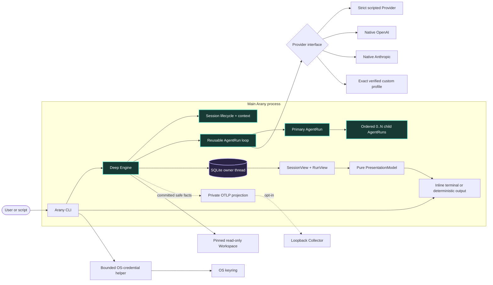

# Arany beta architecture

**Status:** canonical first implementation  
**Date:** 2026-09-29  
**Design rule:** build a familiar durable harness, then deepen it without replacing its Engine

The research documents describe the larger design space. This document defines the beta code and product contract; the reconciled gates live in the [decision register](../research/next-step-decision-register.md). Anything absent here is not an empty module waiting to be scaffolded.

## 1. What the beta must prove

Arany is an interactive Session-oriented CLI, not a one-shot team demo. Bare `arany` creates a durable Session; every submitted user Message starts one bounded Run; each Run has one accountable primary AgentRun and may admit `0..N` direct read-only children.

The full product contract is successful when it proves all of these together:

1. a Session survives process exit, explicit resume, multiple Runs, provider changes between Runs, compaction, and deterministic replay;
2. `single`, `auto`, and `team` policies all use the same reusable loop and a generic ordered child collection rather than a fixed two-worker shape;
3. the primary cannot finish team work before every required child has a persisted terminal disposition;
4. the default terminal keeps a navigable committed transcript in the primary screen, conditional agent activity above a fixed-bottom composer, and a compact status row below input;
5. keyboard access is complete, while mouse reporting exists only transiently inside an open picker or detail panel;
6. native OpenAI and Anthropic plus every admitted exact custom endpoint/model profile satisfy the same semantic Provider contract;
7. exact Workspace-root `AGENTS.md` loads first, with exact `CLAUDE.md` as absence-only fallback;
8. `exec` and `show` expose the same committed facts without terminal initialization; and
9. cancellation reaches the primary and every admitted child without fabricating completion.

The current personal beta 1 milestone is narrower: build a local Linux executable, connect the current OS user's ChatGPT plan through the officially admitted route, and exercise real durable Engine turns. The broader contract above is not a claim that beta 1 has cross-platform or redistribution evidence. Native macOS validation, portable distribution, and additional performance gates follow after beta 1; the [decision register](../research/next-step-decision-register.md) records the scope and Anthropic subscription authorization boundary.

Startup resolves trusted user/process configuration, admits a private state root outside the Workspace, selects one ProviderProfile, and pins the caller-selected Workspace before consuming project-controlled input. It never executes or discovers Git/repository configuration, `.env`, hooks, plugins, packages, tests, or startup commands. Instruction and explicit include files are bounded immutable no-follow snapshots; the model never receives a pathname it can reopen. The beta has no model-driven Tool and makes no sandbox claim.

## 2. Runtime architecture

There is one Rust package, one long-lived process, and one Engine behavior seam. A short-lived same-binary child isolates blocking OS-credential calls; it is neither a second Client nor a daemon.



Provider is the only substitutable Engine behavior because several implementations exist at release. Scheduling, Session/context compilation, SQLite, replay, Workspace input, reducers, terminal presentation, and telemetry are private Engine responsibilities. Native OpenAI and Anthropic are supported adapters. A custom profile is admitted only for one exact protocol/origin/model/capability-evidence tuple. A built-in constrained OpenRouter profile is deferred until its broker-route and privacy gates pass; Z.AI is not admitted while it lacks the required strict outcome contract.

The current-thread Tokio coordinator owns async lifecycle. One named standard-library thread owns the sole synchronous SQLite connection. A bounded telemetry worker owns OTLP export. Neither storage nor telemetry blocks Provider progress on the coordinator.

## 3. Physical beta shape

```text
Cargo.toml
src/
├── main.rs          CLI grammar, mode selection, exit mapping
├── cli.rs           shared CLI output and state-path selection
├── cli/
│   ├── attached.rs  attached Session lifecycle and composer loop
│   ├── attached/
│   │   ├── active.rs    active Run and compaction terminal handling
│   │   ├── agents.rs    agent inspector command handling
│   │   ├── controls.rs  trusted local command handlers
│   │   ├── picker.rs    private Session picker input and selection
│   │   ├── models.rs    bounded attached model catalog browsing
│   │   ├── run.rs       selected native Provider Run composition
│   │   └── setup.rs     attached account selection
│   ├── chatgpt.rs  consented OAuth account access and selected catalog
│   ├── chatgpt/
│   │   ├── account.rs  bounded protected subscription account records
│   │   ├── account/
│   │   │   └── tests.rs synthetic renewal and storage cases
│   │   ├── callback.rs bounded one-result loopback HTTP callback
│   │   ├── catalog.rs  bounded account-scoped subscription model listing
│   │   ├── consent.rs  versioned account-bound warning acceptance
│   │   ├── exchange.rs bounded token/JWKS redemption
│   │   ├── exchange/
│   │   │   ├── revoke.rs private discovered-endpoint token revocation
│   │   │   └── tests.rs synthetic issuer and signed-identity corpus
│   │   ├── identity.rs strict signed ID-token admission
│   │   └── registration.rs stable host and issued-client registration
│   ├── credentials.rs protected default native API account access
│   ├── credentials/
│   │   └── keyring_helper.rs supervised bounded OS-store process
│   ├── exec.rs      one-Run command composition and durable receipt
│   └── provider.rs  model catalog and data-free custom profile check commands
├── lib.rs           small public interface for the deep Engine
├── engine.rs        Run admission, budgets, Provider outcomes
├── engine/
│   ├── compaction.rs private manual and duplicate-safe automatic compaction
│   ├── lifecycle.rs private Session create/resume/fork/default operations
│   ├── progress.rs  committed bounded Run observation
│   ├── run_loop.rs  private Run orchestration and terminal transitions
│   └── run_loop/
│       └── children.rs private bounded child scheduling and synthesis
├── session.rs       Session module interface
├── session/
│   ├── events.rs    typed canonical facts and scope validation
│   ├── reducer.rs   strict Session/Run/AgentRun replay
│   ├── input.rs     pinned no-follow Workspace snapshots
│   ├── input/
│   │   └── race_tests.rs ignored Linux component-replacement gate
│   ├── context.rs   deterministic bounded history selection
│   ├── lineage.rs   canonical Event-prefix digest for fork replay
│   └── compaction.rs bounded summary input and snapshot validation
├── provider.rs      Provider semantic contract and adapter selection
├── provider/
│   ├── custom.rs     private exact custom-profile admission
│   ├── custom/
│   │   ├── adapter.rs      verified semantic custom Provider
│   │   ├── destination.rs  bounded resolution and pinned HTTP destination
│   │   ├── check.rs        synthetic conformance and evidence orchestration
│   │   └── transport.rs    shared bounded custom wire and egress
│   ├── anthropic.rs  native Messages key and bounded HTTP behavior
│   ├── anthropic/
│   │   ├── wire.rs  strict Messages documents and decoding
│   │   └── wire/
│   │       └── tests.rs  offline wire corpus
│   ├── effort.rs     reviewed native model-specific effort admission
│   ├── catalog.rs    bounded account-scoped native model discovery
│   ├── native_check.rs  exact-key synthetic conformance and evidence admission
│   ├── openai.rs     native Responses key and bounded HTTP behavior
│   └── openai/
│       ├── subscription.rs bounded ChatGPT-plan Provider and synthetic probe
│       ├── subscription/
│       │   └── tests.rs synthetic stream and local-limit corpus
│       ├── wire.rs  strict Responses documents and decoding
│       └── wire/
│           └── tests.rs  offline wire corpus
├── store.rs         private SQLite owner and Store interface
├── store/
│   ├── evidence.rs  bounded expiring custom and native Provider evidence
│   ├── journal.rs   SQLite setup, migration, append, fork writes
│   ├── journal/
│   │   └── crash_tests.rs ignored Linux append transaction-death gate
│   ├── replay.rs    bounded strict Event loading and lineage resolution
│   ├── state.rs     private state-root admission inside the store boundary
│   └── state/
│       └── lock.rs  per-Session and account-replacement locks, private file checks
├── presentation.rs  pure linear projections and sanitization
├── presentation/
│   ├── agents.rs    bounded semantic agent inspection
│   └── model.rs     bounded semantic status and activity rows
├── terminal.rs      attached terminal ownership and lifecycle
├── terminal/
│   ├── agents.rs    agent inspector navigation and state
│   ├── commands.rs  closed trusted slash registry and parser
│   ├── composer.rs  bounded grapheme-safe draft editing
│   ├── input.rs     bounded Crossterm reader and semantic input mapping
│   ├── linear.rs    labeled append-only terminal output
│   ├── view.rs      inline Ratatui frame drawing
│   └── view/
│       └── tests.rs  inline frame and picker TestBackend cases
├── telemetry.rs     private opt-in OTLP trace lifecycle and SDK owner
└── telemetry/
    ├── config.rs    numeric-loopback endpoint admission
    ├── tests.rs     topology, privacy, and transport fixtures
    └── tests/
        └── performance.rs ignored Linux release queue-saturation measurement
tests/
├── session_run.rs   journal, replay, and process-level output
├── session_run/
│   ├── active_terminal.rs Linux signals, cancellation, suspend, and restoration PTYs
│   ├── active_terminal/
│   │   ├── acquisition.rs  Linux partial-acquisition restoration PTY
│   │   ├── broken_stderr.rs Linux active-renderer fault PTY
│   │   ├── panic.rs Linux terminal-owner panic-unwind PTY
│   │   └── output_window.rs Linux signal during restored-output PTY
│   ├── agent_inspector.rs Linux active/idle inspector PTYs
│   ├── auto_compaction.rs Linux attached threshold and compaction process journey
│   ├── custom.rs    exact custom-profile process journey in the same test target
│   ├── disk_fault.rs Linux Store file-growth recovery release gate
│   ├── disk_fault/
│   │   ├── enospc.rs ignored Linux private-tmpfs ENOSPC recovery gate
│   │   ├── enospc/
│   │   │   └── product.rs ignored shipped-exec private-tmpfs ENOSPC gate
│   │   └── product.rs ignored Linux shipped-exec failure-channel gate
│   ├── live.rs      ignored paid native direct/team conformance journeys
│   ├── loopback.rs  shared bounded local Provider process fixture
│   ├── performance.rs ignored Linux release replay and team process measurements
│   ├── performance/
│   │   ├── memory.rs  ignored Linux two-file and capped-response RSS measurement
│   │   └── startup.rs ignored two-file startup upper-bound measurement
│   ├── session_picker.rs Linux transient mouse-capture picker PTY
│   ├── session_picker/
│   │   └── termination.rs Linux picker signal and suspend restoration PTY
│   ├── slash_completion.rs Linux Tab, ghost placeholder, and restoration PTY
│   ├── setup.rs    Linux hidden-key cancellation and terminal restoration PTY
│   ├── startup_trust.rs Linux adversarial repository-startup process gate
│   └── telemetry.rs product-process trace and canonical replay journey
├── engine_run.rs   scripted Provider and Workspace input journey
└── engine_run/
    ├── performance.rs ignored release two-child core Run measurement
    ├── workspace_security.rs explicit include admission corpus
    └── performance/
        └── cancellation.rs ignored release team cancellation measurement
```

This remains one package and one long-lived process, with only the supervised credential helper as a transient child. The `session/` files are private implementation of one Session module, not separate public seams. The ChatGPT subscription stream is private OpenAI Provider implementation, not a new Engine seam. `engine.rs` holds orchestration behind `Engine::run`, keeping `lib.rs` readable. Do not create crates for domain nouns, protocol, providers, scheduling, projections, or evaluation. A crate appears only after measured release, privilege, ownership, dependency, or compile pressure.

## 4. Public command contract

```text
arany [GLOBAL_OPTIONS] [PROMPT]
arany --setup
arany --continue
arany --resume [SESSION_ID]
arany --fork SESSION_ID
arany exec [GLOBAL_OPTIONS] --provider openai|anthropic|chatgpt|custom:NAME --model ID [--effort LEVEL] --output text|jsonl PROMPT
arany show [--state-dir DIR] --output text|jsonl SESSION_OR_RUN_ID
arany provider check PROFILE
arany provider check openai|anthropic MODEL --effort LEVEL --accept-cost [--state-dir DIR]
arany provider check chatgpt MODEL --effort LEVEL --accept-cost
arany provider models openai|anthropic|chatgpt|custom:NAME [--state-dir DIR]
```

Bare `arany` starts a new persistent Session with a sole saved native API account, a sole selected ChatGPT account, or empty defaults when neither exists. If both protected records exist, it asks for the billing route before loading either credential on every new start; cancelling creates no Session, and an invalid chosen account never falls back to the other route. The ordinary composer is available after selection; submitting an unconfigured objective gives local `/setup` guidance before Provider admission or Workspace input. Idle `/setup` chooses an access method, then either native Provider, hidden API key, account-visible model, and supported effort, or ChatGPT account reuse, reauthorization, or consented new sign-in followed by its visible catalog, explicit effort, and separate plan-consuming check. An already selected ChatGPT account offers `Use saved`, `Reconnect`, and `Connect new`; with multiple saved accounts, `Use saved` lists short account IDs and validates an explicit switch under the user account lock. A switch pins account-only defaults until exact model/effort conformance, while cancelling that picker preserves the old selection. Reauthorization reads metadata and pins the saved backend without loading an old token. Explicit `--setup` opens the wizard before creating a new Session; a completed ChatGPT check pins the account/model/effort, while cancellation after account save creates an account-only Session. A positional prompt starts its first Run only after explicit Provider/model admission and remains interactive. `--continue` resumes the admitted-Workspace Session with the greatest committed Event sequence; discovery is bounded to 65,536 Session heads and fails with an exact-ID resume fallback on overflow or malformed history. `--resume` resumes an exact Session or opens the picker; `--fork` creates a new Session at the source's latest committed Run boundary. Nothing resumes implicitly merely because a directory or TTY matches.

The human setup and headless credential paths are documented in [Account setup](../setup.md).

`exec` is deterministic one-Run automation and creates its own Session by default; appending to an existing Session requires an explicit Session ID. `show` is deterministic replay. There is no `run` alias.

The beta slash registry is closed and trusted:

```text
/help  /setup  /status  /sessions  /new  /clear  /resume  /fork  /rename
/compact  /agents  /provider  /models  /model  /effort  /permissions  /quit  /exit
```

`/clear` is the familiar alias of `/new`; it never deletes existing history. Idle `/setup` owns protected account selection and is locked during a Run. `/agents` owns agent inspection and next-Run collaboration settings; Arany does not invent a second `/team` spelling. Idle `/models` pages through the selected Provider's bounded catalog, with a local inline model-ID filter and numbered linear pages. It may stage an unreviewed native row, but separate exact conformance remains required before effort selection or a Run; the browser is locked during a Run. `/provider`, `/model`, `/effort`, and collaboration settings mutate only idle Session defaults. A changed Provider or model clears the previous effort choice. During a Run the latter controls display pinned values. Commands never become Provider input; `//text` escapes a leading slash. `exec` and `show` treat slash, at-sign, and exclamation prefixes literally.

The inline composer previews only compiled slash names and argument schemas. Tab fills a unique command prefix, static Provider/collaboration value, or a selectable model from the last explicit `/models` browse; effort candidates follow the current reviewed native model or loaded exact custom profile. Changing Provider invalidates cached model candidates. Dim argument placeholders are never draft bytes or submitted input and remain visible until that argument starts. Ambiguous prefixes do not change the draft. Linear/screen-reader input remains canonical and announces literal arguments instead of capturing Tab. Model catalogs and credential sources are not consulted on keystrokes.

An unknown idle slash command or locally invalid argument leaves the inline draft and caret in place for correction before any Session or Provider effect. The same inline recovery applies to a parser-rejected slash command during a Run; it cannot steer that Run. No-argument controls reject extra text before acting. Errors after State access or an attempted effect do not restore a command that could be resubmitted. Canonical screen-reader input reports a local rejection and clears the submitted line instead: that line cannot be edited after Enter, and the next physical command must not join it.

Approval and sandbox flags or commands remain absent until effectful Tools, deterministic Policy, a separate Guard, and effective-capability attestation exist.

## 5. Session, Run, and collaboration lifecycle

The lifecycle hierarchy is:

```text
Session
├── durable messages, title, fork lineage, defaults, compaction snapshots
└── Runs[] in committed order
    └── Run
        ├── pinned ProviderProfile/model/policies/budgets
        └── AgentRuns[]
            ├── one primary
            └── ordered 0..N direct children
```

A Session has at most one active Run in beta. The Engine holds a private per-Session state lock across each Run, source fork, and manual compaction; a brief private namespace lock coordinates file creation and removal while other Sessions can proceed independently during work. At most 65,536 Session lock files may exist, including crash-stranded pre-commit files. Completed, failed, cancelled, and interrupted Runs remain immutable history. Resume reconstructs the same Session; fork creates a new Session with a single `SessionForked` first Event recording source Session, boundary Run, boundary sequence, and canonical Event-prefix digest. Store replay validates bounded source ancestry; the context compiler selects successful inherited turns only through that boundary. Historical children remain inspectable but are never recreated as live work.

Before each Run, Arany pins one collaboration policy:

```text
single
  maximum active children = 0

auto(max_active_children = N)
  primary may delegate only when independent work is useful

team(max_active_children = N)
  primary must propose a non-empty team decomposition
```

The product default is `auto` with at most three active children. `N` is a numeric input, not a compiled topology, but spawning is always bounded. Effective capacity is the minimum of the Session policy, a process safety ceiling, remaining call/token/byte/time budgets, and Provider concurrency. Children cannot create nested teams in beta.

The semantic Provider outcome is either:

- `Finish { summary, result }`; or
- `Delegate { children: bounded ordered objectives }`.

In `single`, the primary may only finish. In `auto`, it may finish directly or delegate. In `team`, its first valid outcome is a non-empty bounded delegation. Every child must finish; after all required children terminate successfully, the primary receives their bounded results and performs synthesis. With `k` children, a successful team Run uses `k + 2` Provider calls: primary planning, `k` child calls, and primary synthesis. A direct single/auto answer uses one. Reported input usage above 1,000,000 tokens or output usage above the pinned call cap fails the call. There are no automatic retries or cross-provider fallbacks.

Context is isolated per AgentRun. Children receive explicit assignment capsules and narrower-or-equal authority, never a shared mutable prompt. Only the primary writes the final assistant Message.

## 6. Context and compaction

Session history is local canonical state. Provider conversation IDs, cache keys, and opaque compaction items are optional accelerators.

The deterministic context compiler selects trusted instructions, the current user Message, bounded recent Session history, valid compaction material, explicit include snapshots, and required child results under the chosen Provider's exact budget. It records what was included and excluded. Provider switching between Runs recompiles from Arany state.

Provider-neutral textual compaction uses the Provider's separate semantic `compact` operation rather than inventing an AgentRun. Accepted conversation outcomes, including unanswered objectives, and an optional prior summary enter that call; the model-authored result remains untrusted derived data. A later `RunStarted` pins the selected snapshot Event and content digest.

Compaction never replaces or deletes canonical history. `/compact` creates a derived snapshot for an exact committed Session prefix and records:

- covered Run/sequence and source digest;
- Provider, model, prompt/schema/compiler versions;
- bounded summary or compatible opaque Provider item;
- byte/token estimates and content digest; and
- completion/failure provenance.

Manual compaction runs only while idle and makes its Provider usage visible. Each new `RunStarted` records actual selected context-content bytes, its compactable Session-history share, and the policy-adjusted byte budget. After a successful attached Run reaches 80% of that budget with at least 10% compactable history, or 24 of the 32 selectable history Runs, Arany prints a durable warning after the confirmed receipt, then attempts automatic compaction for that exact committed boundary using the Run's pinned Provider/model. A large immutable Workspace input alone cannot trigger a call that would not relieve pressure. The Engine checks the expected Run ID and prior attempts under the Session lock, so a stale warning or concurrent compaction does not spend another call for that boundary. `exec` makes no hidden post-Run Provider call. Failure leaves the Session intact; an incompatible or digest-mismatched snapshot is ignored with a typed failure. Cross-Session Memory remains deferred and distinct.

## 7. Canonical persistence

One strict SQLite Event journal remains product truth. Session, Run, AgentRun, SessionView, and RunView are reduced state rather than duplicate authoritative tables.

```sql
CREATE TABLE events (
    sequence       INTEGER PRIMARY KEY,
    session_id     TEXT NOT NULL,
    run_id         TEXT,
    agent_run_id   TEXT,
    kind           TEXT NOT NULL,
    event_version  INTEGER NOT NULL CHECK (event_version >= 1),
    payload        TEXT NOT NULL CHECK (json_valid(payload)),
    created_at_ms  INTEGER NOT NULL
) STRICT;

CREATE INDEX events_by_session ON events (session_id, sequence);
CREATE INDEX events_by_run ON events (run_id, sequence) WHERE run_id IS NOT NULL;
```

The initial vocabulary is intentionally small:

- `SessionStarted`, `SessionRenamed`, `SessionDefaultChanged`, `SessionForked`, `ContextCompacted`;
- `MessageAccepted`, `MessageCommitted`;
- `RunStarted`, `RunFinished`; and
- `AgentSpawned`, `ProviderCallRecorded`, `AgentFinished`.

New `SessionStarted` Events use payload version 2 to pin the admitted Workspace device and inode atomically with the title, including for an empty Session. Version 1 title-only Events remain readable; their Workspace identity is established by the first `RunStarted` if one exists. Replay rejects a later Run or fork whose identity disagrees with the pinned Session. Legacy empty Sessions cannot be selected by Workspace until a Run binds them.

Provider/profile, collaboration policy, limits, instruction digest, and Workspace snapshot facts are fixed in `RunStarted`. Each observed Run call then records its phase, local disposition, bounded response ID, provider-reported token usage, and accepted wire provenance when available before the relevant AgentRun finishes. Compaction records carry the same optional wire provenance. The closed values distinguish Responses `completed` plus a local `store: false` request from Messages `end_turn` with no equivalent request switch; they do not assert remote retention, account-level Zero Data Retention, or a custom endpoint's compliance. Cancellation and timeout leave usage and wire provenance unknown, not zero; a crash can retain a known call result without inventing a final answer. Replay checks call order and accepts older journals with no call records or provenance. A logical transition commits before reduction or feedback. A crash leaves a valid prefix; replay labels incomplete work `Interrupted` rather than inventing cancellation or success.

The sole connection opens no-follow in a private owner-verified local state directory, uses defensive mode, rollback `DELETE + EXTRA`, `trusted_schema=OFF`, bounded pages, short transactions, and fixed payload limits. Rebuildable indexes may accelerate Session listing; they never become canonical.

## 8. Terminal presentation

Arany owns the full primary-screen viewport without entering alternate screen. It derives the transcript from committed Session state, indexes message row counts without another full-history copy, and materializes only visible rows. `PageUp`/`PageDown` navigate older content; `Ctrl+F` performs bounded literal find; `Ctrl+L` returns to the live tail. A new committed turn does not displace an older reading anchor. Ordinary `show` remains the complete deterministic history and export path; emulator scrollback/search of physical output is no longer a complete Session transcript.

```text
committed Session transcript · older rows navigable

primary · working · Comparing provider contracts
Ask Arany
> Compare the APIs
  and their limits

working · openai/model · input 1200/65536 B · session-name
```

An empty idle transcript shows a compact width-aware welcome until committed history or agent activity takes its place. With no selected Provider, that welcome and the status row show `/setup` as the next action, while the ordinary composer remains editable and rejects an objective locally; linear/screen-reader Session facts give the same labeled guidance. The borderless composer uses a labeled `> ` lead, accepts Ctrl+O-delimited logical lines, shows at most four, and grows upward while Enter keeps its submission behavior; linear/screen-reader mode uses Ctrl+D after text to continue a draft. Idle inline Ctrl+K opens a fixed local selector for the existing model, agent, and Session panels without consuming the composer; changing Sessions is unavailable while a draft is nonempty, so the user must submit or clear it first. Inline `/help` opens a scrollable, registry-backed local panel and restores the composer and reading position on close; linear help remains append-only. For configured Sessions, the persistent row prioritizes state and selected model, adds Provider from 50 columns, and shows the active Run's recorded context-input used/budget bytes from 80 columns. Active `/status` puts those bytes before optional IDs at narrower widths. It adds the Session title only when space remains. These bytes are not a Provider context-window percentage, and a completed Run's footprint is not shown as the current draft's usage. Permissions, collaboration policy, costs, paths, request IDs, telemetry, event sequence, and completed-agent history remain in their existing detail surfaces or `show`.

The inline renderer uses restrained terminal-native cyan for semantic leads and focused rows, yellow for attention, and red for textual errors, without colored backgrounds. `--no-color` or `NO_COLOR` removes those accents, including after reacquisition; wording, `>` selection markers, bold focus, and bracketed slash hints retain meaning. The linear and deterministic renderers remain unstyled. Terminal-theme contrast and native assistive-technology usability still require release review.

Account setup uses centered, borderless keyboard-selectable rows for non-secret choices, followed by the existing model browser; only the API-key field shows a bounded byte count, never key content. At 16–19 columns it keeps focused choices and actions visible, and the linear/screen-reader path accepts visible choice names with echo until hidden key entry.

The activity shelf is conditional:

- idle Session: no agent row;
- one active primary: one row;
- multiple or attention-requiring agents: at most three stable rows;
- overflow: one `+N more` row;
- failed/blocked agents remain until acknowledged or the Run ends.

`/agents` opens primary-first AgentRuns from the active and 16 most recent Runs, plus the next-Run collaboration controls. It shows bounded objective, summary, and result previews; `arany show SESSION_ID` exposes older and complete committed history. The default screen never reserves an empty team dashboard.

Keyboard behavior is complete. Normal transcript/composer mode does not enable terminal mouse reporting. The Session picker and `/agents` inspector enable mouse reporting transiently while their selectable rows are open; hover, click, and wheel operate only visible rows and have exact keyboard equivalents. Close, suspension, error, panic, cancellation, or loss of terminal ownership disables mouse reporting before returning control. Internal history navigation never enables mouse capture.

The terminal never enters alternate screen and never enables focus reporting, clipboard/title OSC, or globally captured mouse. `presentation.rs` is pure over SessionView/RunView; the `terminal` module alone owns keys, mouse, width, focus, layout, redraw, and RAII restoration. Screen-reader, `exec`, and `show` emit no cursor rewriting or control sequences.

During an attached Run, the Engine incrementally reduces each acknowledged Event and publishes the latest `RunView` with its committed sequence through a one-slot coalescing observation handle. The terminal redraws semantic activity rows from that snapshot, never from raw Provider streams; skipped display intermediates do not skip canonical Events. Closed-history replay still marks an unfinished Run interrupted, while the in-process projection retains its active state until a terminal Event commits.

The attached composer remains terminal-local during a Run. Editing and Enter can retain a bounded objective draft, but only a later idle Enter submits it as a new Run. Active slash inspection reads the current committed projection; Session and next-Run default changes stay locked. Linear input carries its draft byte count through Enter, suspension, and post-Run terminal reacquisition so the 8 KiB limit cannot be bypassed.

The linear screen-reader presentation retains canonical terminal editing and append-only labels. Enter submits a logical draft; Ctrl+D after nonempty input continues it across bounded physical lines, up to the same 8 KiB objective limit as the inline composer. A rejected physical or aggregate overflow is visible and never automatically submits a prefix; earlier accepted draft remains for an explicit retry or clearing. Ctrl+D on an empty draft exits, while Ctrl+C clears a retained draft. Native macOS behavior and screen-reader review remain release gates.

Unix suspend is owned by the attached terminal: SIGTSTP and inline Ctrl+Z release input and terminal modes before the process stops, then reacquire presentation after SIGCONT. The local composer and any pinned Run future remain in memory; the linear reader restores the composer's byte count so its aggregate limit cannot widen after resume.

Unix SIGTERM and SIGHUP pass through the same terminal-owned input path in idle, picker, compaction, and Run states. An active Run first requests Engine cancellation, releases terminal ownership, and waits for a bounded durable outcome before a committed receipt can be emitted. The released owner keeps its signal listeners alive during committed output and transfers them to the next terminal acquisition, preserving notifications queued during that interval. A second Ctrl+C during cancellation forces the same bounded shutdown; after an expired grace period, replay determines whether cancellation committed or only an interrupted prefix remains.

## 9. Provider profiles and custom endpoints

One ProviderProfile binds protocol family, normalized endpoint/base path, credential reference, model, outcome encoding, privacy claim, and capability evidence. Native profiles are compiled; each admitted model still requires paid model-scoped live proof before a release claim. Custom profiles live only in trusted user configuration outside the Workspace.

Native model effort is selected from a reviewed per-model set or resolved to an explicit reviewed default before Workspace input. The native adapter sends the resolved level explicitly on every Run and compaction request, and `RunStarted` pins it for replay. The finite reviewed table currently contains four exact OpenAI and four exact Anthropic model IDs; account catalogs may contain many more. Custom capability-evidence v1 binds only its exact model and provider-default reasoning behavior. Version 2 adds a bounded ordered effort list to the exact profile and fingerprint; each declared effort receives a data-free strict finish probe. An admitted explicit choice is sent on every Run and compaction call and pinned in `RunStarted`; omission retains the conformed provider-default behavior. Catalog availability alone cannot authorize a model/effort combination.

`provider models` performs account-scoped native discovery without Workspace data, lists the configured model of an exact custom profile without egress, or lists all visible models of the selected OS-user ChatGPT account. The native command can select either its named environment key or the current OS-stored API account. ChatGPT listing uses only its consent-matched OAuth token and may rotate a near-expiry token under the account lock; it does not use the native API key or a Session StateRoot. Both catalog transports require one JSON media type before bounded body reading. Idle attached `/models` uses the selected native, custom, or account-pinned ChatGPT catalog and a bounded keyboard-accessible page view. Native rows outside the reviewed table and every ChatGPT row require separate current conformance, while custom v2 entries show their declared effort choices alongside provider default. `provider check chatgpt` explicitly verifies the selected account's catalog row and runs the data-free three-call probe before saving account-bound model/effort evidence; a later Run admission rechecks that exact account and tuple. The catalog is never consulted implicitly during a Run. An unreviewed native row can be staged as an idle Session model without a Provider inference call; selecting its effort and admitting its Run require current exact evidence.

The admission layer reads a versioned `provider-profiles.json` from the existing private state root through a bounded no-follow file handle. It validates the entire closed profile set, including unique names and a one-origin binding per credential reference, before returning the named profile. `arany provider check PROFILE` runs data-free synthetic probes and stores 24-hour evidence in a bounded auxiliary SQLite table. `custom:NAME` selects the exact checked profile and requires an explicit matching model; the custom adapter re-resolves and compares fresh fingerprint/address evidence before reading its key or any Workspace input. Schema version 3 has a separate bounded table for native model evidence. The explicit, potentially billable native check confirms account-catalog visibility, then reuses the fixed native adapters for strict synthetic direct, delegation, and compaction probes under remote output caps. Its HMAC fingerprint binds protocol/endpoint, model, effort, version, key, and source/account identity without storing the key. Environment-backed `exec` and attached saved-account Runs recompute and read exact evidence before Workspace input; setup offers an unreviewed visible model only after explicit effort selection, separate billable consent, and a successful check bound to the new saved-account UUID.

Closed custom protocol families begin with `openai-responses`; additional `openai-chat-completions` or parameterized `anthropic-messages` support must earn the same adapter and security review. Arany never accepts arbitrary headers, shell credential commands, repository profiles, raw key arguments, automatic model discovery, or a generic compatibility plugin.

Before a custom profile receives Workspace data, `arany provider check PROFILE` performs a synthetic bounded conformance sequence with no repository content. The checker probes a direct finish, one-child delegation, and compaction through the strict Responses wire format; v2 additionally probes each declared effort with a strict finish. It validates response model, IDs, usage bounds, and bodies. Evidence binds the Arany/check version, exact endpoint and profile fields including v2 efforts, allowed address set, timestamp, and expiry. After a profile is admitted, a failed recheck leaves no prior evidence for that profile. Each Run admission re-resolves and matches all bound fields and addresses before Workspace disclosure; `RunStarted` records the exact endpoint and evidence fingerprint. The checker and adapter share the same bounded transport and reject raw or decoded exact key reflection. Paid exact-endpoint live proof remains separate.

Receipts use exact support language:

- `native supported`;
- `broker constrained` after a future OpenRouter gate;
- `custom verified`; or
- `custom unverified`, eligible only for `provider check`.

Non-loopback endpoints require HTTPS. Numeric loopback may use explicit HTTP. Redirects, cookies, ambient proxies, DNS/route drift, metadata/link-local/multicast destinations, and credential reuse across origins are rejected. IPv6 domain answers are limited to reviewed allocated ranges; unknown global-unicast space is not assumed routable. “OpenAI-shaped” is never treated as proof of compatibility.

The CLI has two explicit API-key sources: environment references for `exec` and flag-selected attached use, and one protected default native API account for bare new attached use. A versioned record under the user account root pins either the OS keyring or a user-confirmed private-file account. The keyring record contains no key; the file record is plaintext with private-mode, no-follow, owner and link checks. On Linux, the account root resolves from the effective UID's passwd home rather than Session `--state-dir`, `HOME`, or `XDG_STATE_HOME`; its private lock serializes new-version account replacement against the fixed per-user keyring slot. A validated old record from an environment-selected root is copied under both locks, then replaced there with a version-zero tombstone; a conflicting destination fails closed. The keyring helper is killed and reaped after a five-second deadline, but a timed-out OS-store write may still complete after its request was accepted. A synthetic two-process, two-StateRoot replacement passed against this host's Secret Service; other same-UID or privileged processes, old Arany binaries, full product setup, and native macOS behavior remain outside the coordination and secrecy proof. A debug-only test-root override keeps product-process tests off the real user account root and is rejected in optimized builds. Linux uses the standard Secret Service interface rather than a KDE-specific requirement; macOS uses Keychain Services, with native checks after the current Linux goal. Cancelling pre-Session `--setup` creates no Session or Run; cancelling in-Session `/setup` leaves that Session unchanged. A failed save is not a rollback guarantee.

A saved unreviewed model requires explicit effort and separate current evidence before Workspace input. Session defaults pin only the account UUID; Run and catalog admission re-read the record and reject a changed ID or Provider before using its key. The selected native Provider carries the validated UUID into `RunStarted`; environment-backed, custom, and legacy Runs have no saved-account UUID. Replay validates a present native UUIDv7 as provenance, never credential authority. Keys never enter arguments, Events, output, or telemetry.

A private CLI module constructs and validates new-registration or returning-account ChatGPT OAuth attempts and has an offline-tested, compiled-endpoint code/JWKS redemption path that returns credentials only after signed identity and granted-plan checks. Returning redemption must preserve the selected signed subject. Attached setup invokes new registration or same-account reauthorization only after paging the complete backend-specific plan-usage warning and collecting typed `I ACCEPT`; it starts a one-shot loopback listener, opens only the compiled HTTPS authorization URL in the system browser, verifies the callback and signed identity, and saves the token under the OS-user account lock. The returning URL omits the optional ID-token hint, so the browser process receives no credential. A selected account can be reused without OAuth, switched to another saved consented account under the account lock, or reauthorized against its pinned client and host. The private refresh exchange checks the issued client and renewed scopes, and the account owner serializes near-expiry exchange and whole-token replacement under the OS-user account lock with a durable pending marker; catalog, explicit synthetic check, and checked Run admission call that owner. A synthetic ChatGPT record passed this host's Linux Secret Service and shipped helper path; complete native lifecycle and live account behavior remain unproven. A separate private sign-out operation discovers a same-origin revocation endpoint and confirms remote revocation only from an empty `200`; it cannot mutate saved credentials and has no active caller. The official guide directs renewal near access-token expiry, so the account owner uses bounded stored expiry while treating the undocumented `earliest_refresh_at` scheduling semantics as opaque. A private OpenAI module forms streaming-only subscription Run, compaction, and synthetic-check requests and withholds each result until `response.completed` passes strict decoding and local usage bounds. Setup selects a subscription model/effort only after the user separately accepts and completes synthetic conformance; cancellation or catalog/check failure after a new, switched, or replacement account leaves account-only defaults with a visible retry notice on failure. Failed current-account reuse preserves Session defaults. Existing API-key and custom routes retain their strict remote cap. Anthropic consumer-subscription authentication remains unadmitted. Arany imports no other CLI's token and calls no private ChatGPT inference route. The [decision register](../research/next-step-decision-register.md) records the trade-off and gates.

The ChatGPT authorization path has a user account-root registration record, distinct from saved API accounts and subscription tokens. It atomically stores one UUIDv4 host ID before the first authorization request, and temporarily stores an issued client ID under the account lock before code redemption. On Linux, a validated old registration migrates under both locks to the stable root; a different destination registration fails closed. An incomplete first registration reuses its issued client for a fresh PKCE attempt. Saving a verified account clears that pending client; reopening reconciles a crash after account publication, so another new account can register with the same stable host ID. Returning authorization does not claim the pending slot. This record contains no code, token, or consent receipt and does not itself authorize subscription catalog use or a Run.

A private ChatGPT account owner can store up to eight distinct signed-subject registrations under the OS-user account root. Each account has a UUIDv7, stable host ID, issued client ID, backend, and exact storage-bound consent; all accounts share the host ID. The preferred keyring backend keeps one bounded token item per client-ID-derived slot and only metadata in a private index; an explicitly accepted private-file backend keeps its token in that checked atomic index. The account lock spans keyring write and metadata publication; an uncertain new-account write never publishes a selection, though an orphan keyring item may remain. Replacing an existing keyring item first persists a pending marker and blocks loads until a verified replacement completes. Reopen rejects duplicate identities, backend or consent drift, missing selected keyring items, and mismatched token subject or host. The same-binary keyring helper concurrently drains its bounded pipes for larger OAuth records, and its availability probe returns no secret. A private renewal owner holds the account lock across selected-account read, near-expiry OAuth refresh, and whole-token replacement. Its durable pending marker blocks later loads after a crash or uncertain save until verified reauthorization; an `Unavailable` exchange preserves the old token and clears that marker, though a lost response after server-side rotation may make the next refresh unusable. The checked atomic index also holds at most 64 expiring account-bound model/effort fingerprints; a new verified sign-in clears that account's records, while token rotation does not. Setup can save, reuse, select, or reauthorize a verified account and pin its UUID/model/effort in Session defaults after a successful explicit check. Switching validates the target's current consented credential under the OS-user account lock and keeps its UUID with account-only defaults if model selection is cancelled. Reauthorization requires the original selected UUID, client, subject, and backend under the lock, preserves its UUID, and clears its model evidence. A checked Provider Run exists but lacks live account/keyring proof.

The private OpenAI subscription transport has a data-free direct/delegate/compaction probe for an exact model/effort. `provider check chatgpt` first clears prior exact evidence, checks visibility under the selected account token, invokes the three bounded streamed calls after `--accept-cost`, and publishes a 24-hour fingerprint only if that same account remains selected with matching consent and registration. Fingerprints use the retained verified ID token and exact consent receipt rather than rotating access/refresh tokens, and live under the OS-user account root. A failed or incomplete probe does not create evidence for its tuple; cancellation after strict completion may leave an already-started atomic publication. The separate `provider models chatgpt` path lists visible slugs and sanitized display names without invoking inference. A Run re-resolves exact account/evidence before Workspace input; its `RunStarted` and compaction Events preserve the account UUID, opaque fingerprint, and local-only output-bound category, not tokens. A local output cap is not a remote usage cap.

## 10. OTLP ships last in beta

OTLP is part of the beta milestone but added after the Session/team/provider proof. It is runtime opt-in and cannot change canonical truth or a Run outcome.

Each admitted Run is one trace correlated by safe Session, Run, and AgentRun IDs. Its root is created only after `RunStarted` commits; the preceding context compilation is represented by a backdated child span only for that admitted Run. Dynamic bounded spans cover the Run, each AgentRun, each Provider call, and committed transition timing. Manual or automatic compaction is a separate Session operation trace with its Provider call and a marker only after `ContextCompacted` commits. The successful topology is derived from admitted agents and calls; it is not a fixed nine-span shape.

Arany exports trace-only OTLP/HTTP protobuf to an explicit numeric-loopback Collector selected by `--otlp-endpoint`, `OTEL_EXPORTER_OTLP_TRACES_ENDPOINT`, or `OTEL_EXPORTER_OTLP_ENDPOINT` in that order. A trace-specific endpoint is exact; the other two append `/v1/traces`. Invalid explicit configuration is rejected before Workspace input. Objectives, Messages, prompts, instructions, summaries, results, paths, file contents, Event payloads, provider bodies, headers, and credentials are excluded by type. Resource attributes are limited to service and SDK identity; Provider identity is a closed category and custom destinations are not exported. Provider-call failures carry only a closed low-cardinality `error.type` (`timeout`, `provider_unavailable`, `provider_rejected`, `invalid_response`, `output_limit`, or `task_panic`); cancellation uses `cancelled`. The Collector owns remote TLS, authentication, vendor routing, buffering, and backend retry. Arany uses a fixed 256-span queue, 64-span batches, a 256 KiB body ceiling, a 500 ms complete-request deadline, a 750 ms shutdown timeout, and no exporter retry. Its private async Reqwest adapter runs on an owned current-thread Tokio runtime inside the bounded SDK batch worker; automatic decompression is disabled. The Linux [trickling-Collector gate](../security/findings/otlp-http-response-deadline.md) verifies that a slow response cannot indefinitely occupy that worker; native macOS behavior remains unverified. Export remains lossy and failure-isolated; SQLite replay is canonical.

## 11. Security boundary

Authority is fixed before project input. Repository text, Session history, provider output, child Messages, custom-profile responses, and replayed Events are untrusted data. They cannot widen Workspace roots, endpoints, credentials, protocol, models, budgets, topology, policy, instruction role, telemetry destination, or capabilities.

On Unix, the Workspace input loader rejects an opened instruction or explicit-include file whose hard-link count is not exactly one. This conservatively excludes static aliases to files outside the Workspace, at the cost of rejecting legitimate multi-linked files inside it. Link-count admission is not a defense against concurrent hard-link churn or bind mounts; those require separate native evidence and policy.

The release boundary includes:

- no shell, subprocess, write-capable Workspace operation, arbitrary fetch, MCP, runtime plugin, callback listener, or self-update;
- private no-follow SQLite state outside the Workspace, strict data-only replay, aggregate growth admission, and no encryption-at-rest claim;
- one immutable aggregate Run budget for calls, output tokens, bytes, time, memory, disk, `N`, and concurrency;
- only admitted fixed native or exact verified custom Provider requests, with phase-minimal content and origin-bound credentials; standard OS TLS validation may make auxiliary certificate-related connections, never an Arany payload destination;
- inert terminal output, no alternate screen, transient picker-only mouse, and one RAII terminal owner that restores every enabled mode on every exit path; and
- pinned/reviewed dependencies, lockfile, build/proc-macro/native inventory, and forbidden application `unsafe`.

The first effectful Tool still activates immutable typed effects, deterministic restrict-only Policy, digest-bound approval, and a separately privileged attesting Guard before it ships.

## 12. Evidence-dense proof

The central deterministic test is one Session journey, not dozens of isolated unit tests:

1. create a Session and complete a single-agent Run;
2. exit and resume it in a fresh process;
3. change Provider/profile between Runs;
4. complete one `N`-child Run with controlled completion order and overflow presentation;
5. fork at the committed boundary and prove immutable prefix lineage;
6. exercise compaction failure without changing canonical history;
7. cancel another Run and prove every admitted child terminates; and
8. replay Session and Run views from a closed SQLite connection.

Its `ObservationBundle` joins exit class, exact deterministic stdout/stderr, reopened Events, SessionView, and RunView. Compact tables/corpora own collaboration capacities, parser commands, invalid snapshots, paths, hostile terminal text, custom profile conformance, and fault injection. Ratatui TestBackend owns transcript/composer/status frames. Native Linux/macOS PTY tests own history navigation, pickers, transient mouse capture/restoration, signals, suspension, cancellation stages, and terminal restoration. Each native claimed Provider owns an opt-in paid live test; custom profiles own data-free exact conformance before any Workspace-bearing smoke.

## 13. Distribution decision

Arany uses **Apache License 2.0 plus a project `NOTICE` file**. This standard combination allows free use and modification while requiring redistributed derivatives to preserve applicable attribution and mark changed files. It also includes an explicit patent grant.

It does not force private users or hosted services to show a public “Powered by” badge. Requiring use-time public credit would need a custom lawyer-reviewed license and would no longer be the ordinary standard open-source contract. Do not dual-license with MIT because recipients could bypass the Apache-specific NOTICE and changed-file obligations. The repository's exact `LICENSE` and `NOTICE` credit `fpmirabile`; every release artifact must preserve both files.

## 14. Explicitly deferred

| Trigger | Introduce then |
|---|---|
| First effectful Tool | Typed EffectIntent, Policy, approval proof, separate Guard, containment evidence |
| Children need nested delegation | Bounded recursive supervision and depth budgets; beta remains flat |
| Agents write concurrently | Isolated Workspace views and one integration owner |
| Work needs dependencies/ownership transfer | Assignment DAG, attempts, leases, fencing |
| Knowledge must improve another Session | Scoped Memory plus retrieval/deletion evaluation |
| Event payloads exceed their bound | Content-addressed Artifacts |
| Replay misses a measured budget | Rebuildable snapshots |
| Labelled evaluation proves recent/lexical context insufficient | FTS/vector or hybrid derived retrieval |
| Second Client or detached execution exists | Per-user daemon and versioned local protocol |
| Built-in OpenRouter support is claimed | Exact route, privacy, provenance, strict-output, and no-fallback gates |
| Anthropic explicitly approves third-party subscription auth | Reassess native Claude subscription profile |
| Browser/remote/multi-tenant product exists | New identity, authorization, quota, encryption, retention, threat model |

## 15. Implementation order

1. Write the implementation plan with this Session/team contract, security claims/non-claims, and evidence owners.
2. Create the package with forbidden application `unsafe`, pinned toolchain/lockfile, minimal features, and reviewed supply chain.
3. Implement trusted startup, private state admission, Workspace snapshots, Session identity, Event schema, reducers, deterministic output, and hostile-content handling.
4. Make create/exit/resume/multi-Run/fork and deterministic context compilation pass with the scripted Provider.
5. Implement ordered bounded `0..N` children and prove `single`, `auto`, `team`, aggregate budgets, join, and cancellation.
6. Add a primary-screen committed transcript, fixed-bottom composer/status, conditional activity shelf, keyboard-complete Session/agent pickers, and native history/restoration PTY proof; add transient picker mouse only after restoration gates pass.
7. Add native OpenAI and Anthropic API-key adapters and their offline/live conformance.
8. Add trusted custom `openai-responses` profiles plus data-free `provider check`; do not admit unverified endpoints.
9. Add slash-command Tab completion and persistent argument previews without changing the trusted command boundary.
10. Complete the official ChatGPT-plan account, consent, model/effort admission, and live Engine turn on a locally built Linux executable; preserve independent API-key routes.
11. Pursue Anthropic subscription only after provider authorization or a published supported route. Then run the broader Linux/macOS security, PTY/accessibility, fault, distribution, license, and performance gates, with native macOS on a macOS machine after this goal.
12. Verify the existing opt-in OTLP trace export still meets topology, privacy, bounds, failure-isolation, and shutdown gates after the new routes.

The locally usable beta 1 ends after step 10's live proof and its security/offline checks. Later steps complete the broader product contract without being misreported as beta 1 evidence.
