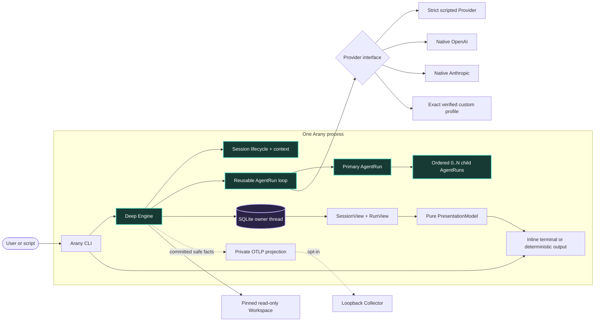

# Arany beta architecture

**Status:** canonical first implementation  
**Date:** 2026-09-29  
**Design rule:** build a familiar durable harness, then deepen it without replacing its Engine

The research documents describe the larger design space. This document defines the beta code and product contract; the reconciled gates live in the [decision register](../research/next-step-decision-register.md). Anything absent here is not an empty module waiting to be scaffolded.

## 1. What the beta must prove

Arany is an interactive Session-oriented CLI, not a one-shot team demo. Bare `arany` creates a durable Session; every submitted user Message starts one bounded Run; each Run has one accountable primary AgentRun and may admit `0..N` direct read-only children.

The beta is successful when it proves all of these together:

1. a Session survives process exit, explicit resume, multiple Runs, provider changes between Runs, compaction, and deterministic replay;
2. `single`, `auto`, and `team` policies all use the same reusable loop and a generic ordered child collection rather than a fixed two-worker shape;
3. the primary cannot finish team work before every required child has a persisted terminal disposition;
4. the default terminal feels like established coding harnesses: native-scrollback transcript, composer, compact status row below input, and a conditional agent activity shelf;
5. keyboard access is complete, while mouse reporting exists only transiently inside an open picker or detail panel;
6. native OpenAI and Anthropic plus every admitted exact custom endpoint/model profile satisfy the same semantic Provider contract;
7. exact Workspace-root `AGENTS.md` loads first, with exact `CLAUDE.md` as absence-only fallback;
8. `exec` and `show` expose the same committed facts without terminal initialization; and
9. cancellation reaches the primary and every admitted child without fabricating completion.

Startup resolves trusted user/process configuration, admits a private state root outside the Workspace, selects one ProviderProfile, and pins the caller-selected Workspace before consuming project-controlled input. It never executes or discovers Git/repository configuration, `.env`, hooks, plugins, packages, tests, or startup commands. Instruction and explicit include files are bounded immutable no-follow snapshots; the model never receives a pathname it can reopen. The beta has no model-driven Tool and makes no sandbox claim.

## 2. Runtime architecture

There is one Rust package, one process, and one Engine behavior seam.



Provider is the only substitutable Engine behavior because several implementations exist at release. Scheduling, Session/context compilation, SQLite, replay, Workspace input, reducers, terminal presentation, and telemetry are private Engine responsibilities. Native OpenAI and Anthropic are supported adapters. A custom profile is admitted only for one exact protocol/origin/model/capability-evidence tuple. A built-in constrained OpenRouter profile is deferred until its broker-route and privacy gates pass; Z.AI is not admitted while it lacks the required strict outcome contract.

The current-thread Tokio coordinator owns async lifecycle. One named standard-library thread owns the sole synchronous SQLite connection. A bounded telemetry worker owns OTLP export. Neither storage nor telemetry blocks Provider progress on the coordinator.

## 3. Physical beta shape

```text
Cargo.toml
src/
├── main.rs          CLI grammar, mode selection, composition, exit mapping
├── lib.rs           deep Engine, loop, budgets, SessionView and RunView
├── session.rs       Session lifecycle, fork/resume/compaction, context compiler
├── provider.rs      Provider contract, native adapters, exact custom profiles
├── store.rs         private SQLite owner, migration, append, replay
├── presentation.rs  pure bounded PresentationModel and linear projections
├── terminal.rs      inline Ratatui view, pickers, transient mouse, RAII ownership
└── telemetry.rs     private opt-in OTLP trace projection
tests/
└── session_run.rs   central deterministic product journey
```

This remains one package and one process. `session.rs` exists because durable resume/fork/compaction and deterministic context construction form one deep lifecycle boundary. Do not create crates for domain nouns, protocol, providers, scheduling, projections, or evaluation. A crate appears only after measured release, privilege, ownership, dependency, or compile pressure.

## 4. Public command contract

```text
arany [GLOBAL_OPTIONS] [PROMPT]
arany --continue
arany --resume [SESSION_ID]
arany --fork SESSION_ID
arany exec [GLOBAL_OPTIONS] --output text|jsonl PROMPT
arany show [--state-dir DIR] --output text|jsonl SESSION_OR_RUN_ID
arany provider check PROFILE
```

Bare `arany` starts a new persistent Session. A positional prompt starts its first Run and remains interactive. `--continue` resumes the last admitted-Workspace Session; `--resume` resumes an exact Session or opens the picker; `--fork` creates a new Session at the source's latest committed Run boundary. Nothing resumes implicitly merely because a directory or TTY matches.

`exec` is deterministic one-Run automation and creates its own Session by default; appending to an existing Session requires an explicit Session ID. `show` is deterministic replay. There is no `run` alias.

The beta slash registry is closed and trusted:

```text
/help  /status  /sessions  /new  /clear  /resume  /fork  /rename
/compact  /agents  /provider  /model  /permissions  /quit  /exit
```

`/clear` is the familiar alias of `/new`; it never deletes existing history. `/agents` owns agent inspection and next-Run collaboration settings; Arany does not invent a second `/team` spelling. `/provider`, `/model`, and collaboration settings mutate only idle Session defaults. During a Run they display the pinned values. Commands never become Provider input; `//text` escapes a leading slash. `exec` and `show` treat slash, at-sign, and exclamation prefixes literally.

Approval and sandbox flags or commands remain absent until effectful Tools, deterministic Policy, a separate Guard, and effective-capability attestation exist.

## 5. Session, Run, and collaboration lifecycle

The lifecycle hierarchy is:

```text
Session
├── durable messages, title, fork lineage, defaults, compaction snapshots
└── Runs[] in committed order
    └── Run
        ├── pinned ProviderProfile/model/policies/budgets
        └── AgentRuns[]
            ├── one primary
            └── ordered 0..N direct children
```

A Session has at most one active Run in beta. Completed, failed, cancelled, and interrupted Runs remain immutable history. Resume reconstructs the same Session; fork creates a new Session and records source Session, boundary Run, boundary sequence, and prefix digest. Historical children remain inspectable but are never recreated as live work.

Before each Run, Arany pins one collaboration policy:

```text
single
  maximum active children = 0

auto(max_active_children = N)
  primary may delegate only when independent work is useful

team(max_active_children = N)
  primary must propose a non-empty team decomposition
```

The product default is `auto` with at most three active children. `N` is a numeric input, not a compiled topology, but spawning is always bounded. Effective capacity is the minimum of the Session policy, a process safety ceiling, remaining call/token/byte/time budgets, and Provider concurrency. Children cannot create nested teams in beta.

The semantic Provider outcome is either:

- `Finish { summary, result }`; or
- `Delegate { children: bounded ordered objectives }`.

In `single`, the primary may only finish. In `auto`, it may finish directly or delegate. In `team`, its first valid outcome is a non-empty bounded delegation. Every child must finish; after all required children terminate successfully, the primary receives their bounded results and performs synthesis. With `k` children, a successful team Run uses `k + 2` Provider calls: primary planning, `k` child calls, and primary synthesis. A direct single/auto answer uses one. There are no automatic retries or cross-provider fallbacks.

Context is isolated per AgentRun. Children receive explicit assignment capsules and narrower-or-equal authority, never a shared mutable prompt. Only the primary writes the final assistant Message.

## 6. Context and compaction

Session history is local canonical state. Provider conversation IDs, cache keys, and opaque compaction items are optional accelerators.

The deterministic context compiler selects trusted instructions, the current user Message, bounded recent Session history, valid compaction material, explicit include snapshots, and required child results under the chosen Provider's exact budget. It records what was included and excluded. Provider switching between Runs recompiles from Arany state.

Compaction never replaces or deletes canonical history. `/compact` creates a derived snapshot for an exact committed Session prefix and records:

- covered Run/sequence and source digest;
- Provider, model, prompt/schema/compiler versions;
- bounded summary or compatible opaque Provider item;
- byte/token estimates and content digest; and
- completion/failure provenance.

Manual compaction runs only while idle and makes its Provider usage visible. Automatic compaction may run only at a committed Run boundary after a visible threshold warning. Failure leaves the Session intact; an incompatible or digest-mismatched snapshot is ignored with a typed failure. Cross-Session Memory remains deferred and distinct.

## 7. Canonical persistence

One strict SQLite Event journal remains product truth. Session, Run, AgentRun, SessionView, and RunView are reduced state rather than duplicate authoritative tables.

```sql
CREATE TABLE events (
    sequence       INTEGER PRIMARY KEY,
    session_id     TEXT NOT NULL,
    run_id         TEXT,
    agent_run_id   TEXT,
    kind           TEXT NOT NULL,
    event_version  INTEGER NOT NULL CHECK (event_version >= 1),
    payload        TEXT NOT NULL CHECK (json_valid(payload)),
    created_at_ms  INTEGER NOT NULL
) STRICT;

CREATE INDEX events_by_session ON events (session_id, sequence);
CREATE INDEX events_by_run ON events (run_id, sequence) WHERE run_id IS NOT NULL;
```

The initial vocabulary is intentionally small:

- `SessionStarted`, `SessionRenamed`, `SessionDefaultChanged`, `SessionForked`, `ContextCompacted`;
- `MessageAccepted`, `MessageCommitted`;
- `RunStarted`, `RunFinished`; and
- `AgentSpawned`, `AgentUpdated`, `AgentFinished`.

Provider/profile, collaboration policy, limits, instruction digest, and Workspace snapshot facts are fixed in `RunStarted`. A logical transition commits before reduction or feedback. A crash leaves a valid prefix; replay labels incomplete work `Interrupted` rather than inventing cancellation or success.

The sole connection opens no-follow in a private owner-verified local state directory, uses defensive mode, rollback `DELETE + EXTRA`, `trusted_schema=OFF`, bounded pages, short transactions, and fixed payload limits. Rebuildable indexes may accelerate Session listing; they never become canonical.

## 8. Terminal presentation

Arany owns only a bounded bottom viewport. Committed transcript lines move into the normal terminal buffer and remain available to native scrollback, search, selection, tmux, and crash recovery.

```text
transcript in native scrollback

┌──────────────────────────────────────────────────────────────────┐
│ Ask Arany…                                                      │
└──────────────────────────────────────────────────────────────────┘
session-name · openai/model · read-only · auto · context 68%
● primary  working  Comparing provider contracts
```

The persistent row prioritizes Session label, pinned or next-Run Provider/model, effective permission profile, collaboration policy, and remaining context when known. Full usage, costs, paths, request IDs, telemetry, event sequence, and completed-agent history belong in `/status`, `/agents`, transcript, or `show`.

The activity shelf is conditional:

- idle Session: no agent row;
- one active primary: one row;
- multiple or attention-requiring agents: at most three stable rows;
- overflow: one `+N more` row;
- failed/blocked agents remain until acknowledged or the Run ends.

`/agents` opens every active/recent AgentRun and the collaboration controls. The default screen never reserves an empty team dashboard.

Keyboard behavior is complete. Normal transcript/composer mode does not enable terminal mouse reporting. An open command palette, Session picker, or agent picker may enable mouse reporting transiently; hover, click, and wheel operate only that surface and have exact keyboard equivalents. Close, suspension, error, panic, cancellation, or loss of terminal ownership disables mouse reporting before returning control. Native scrollback wins over mouse enhancement.

The terminal never enters alternate screen and never enables focus reporting, clipboard/title OSC, or globally captured mouse. `presentation.rs` is pure over SessionView/RunView; `terminal.rs` alone owns keys, mouse, width, focus, layout, redraw, and RAII restoration. Screen-reader, `exec`, and `show` emit no cursor rewriting or control sequences.

## 9. Provider profiles and custom endpoints

One ProviderProfile binds protocol family, normalized endpoint/base path, credential reference, model, outcome encoding, privacy claim, and capability evidence. Native profiles are compiled and release-tested. Custom profiles live only in trusted user configuration outside the Workspace.

Closed custom protocol families begin with `openai-responses`; additional `openai-chat-completions` or parameterized `anthropic-messages` support must earn the same adapter and security review. Arany never accepts arbitrary headers, shell credential commands, repository profiles, raw key arguments, automatic model discovery, or a generic compatibility plugin.

Before a custom profile receives Workspace data, `arany provider check PROFILE` performs a synthetic bounded conformance sequence with no repository content. Evidence is keyed by Arany version, adapter/test version, exact normalized origin, model, outcome encoding, requested output cap, timestamp, and expiry. It must prove strict outcome enforcement, server-side output bound, safe auth behavior, fixed route/model, bounded errors/body/time, cancellation, and labeled usage provenance. Any relevant change invalidates evidence.

Receipts use exact support language:

- `native supported`;
- `broker constrained` after a future OpenRouter gate;
- `custom verified`; or
- `custom unverified`, eligible only for `provider check`.

Non-loopback endpoints require HTTPS. Numeric loopback may use explicit HTTP. Redirects, cookies, ambient proxies, DNS/route drift, metadata/link-local/multicast destinations, and credential reuse across origins are rejected. “OpenAI-shaped” is never treated as proof of compatibility.

Beta authentication remains API-key only. OpenAI plan-funded inference is blocked while its route cannot enforce Arany's remote output cap; Anthropic consumer-subscription authentication requires prior approval. Arany imports no other CLI's token and calls no private ChatGPT route.

## 10. OTLP ships last in beta

OTLP is part of the beta milestone but added after the Session/team/provider proof. It is runtime opt-in and cannot change canonical truth or a Run outcome.

Each Run is one trace correlated by safe Session, Run, and AgentRun IDs. Dynamic bounded spans cover the Run, each AgentRun, each Provider call, context compilation/compaction when applicable, and durable transition timing. The successful topology is derived from admitted agents and calls; it is not a fixed nine-span shape.

Arany exports trace-only OTLP/HTTP protobuf to an explicit numeric-loopback Collector. Objectives, Messages, prompts, instructions, summaries, results, paths, file contents, Event payloads, provider bodies, headers, and credentials are excluded by type. The Collector owns remote TLS, authentication, vendor routing, and backend retry. Export remains bounded, lossy, and failure-isolated.

## 11. Security boundary

Authority is fixed before project input. Repository text, Session history, provider output, child Messages, custom-profile responses, and replayed Events are untrusted data. They cannot widen Workspace roots, endpoints, credentials, protocol, models, budgets, topology, policy, instruction role, telemetry destination, or capabilities.

The release boundary includes:

- no shell, subprocess, write-capable Workspace operation, arbitrary fetch, MCP, runtime plugin, callback listener, or self-update;
- private no-follow SQLite state outside the Workspace, strict data-only replay, aggregate growth admission, and no encryption-at-rest claim;
- one immutable aggregate Run budget for calls, output tokens, bytes, time, memory, disk, `N`, and concurrency;
- only admitted fixed native or exact verified custom Provider egress, with phase-minimal content and origin-bound credentials;
- inert terminal output, no alternate screen, transient picker-only mouse, and one RAII terminal owner that restores every enabled mode on every exit path; and
- pinned/reviewed dependencies, lockfile, build/proc-macro/native inventory, and forbidden application `unsafe`.

The first effectful Tool still activates immutable typed effects, deterministic restrict-only Policy, digest-bound approval, and a separately privileged attesting Guard before it ships.

## 12. Evidence-dense proof

The central deterministic test is one Session journey, not dozens of isolated unit tests:

1. create a Session and complete a single-agent Run;
2. exit and resume it in a fresh process;
3. change Provider/profile between Runs;
4. complete one `N`-child Run with controlled completion order and overflow presentation;
5. fork at the committed boundary and prove immutable prefix lineage;
6. exercise compaction failure without changing canonical history;
7. cancel another Run and prove every admitted child terminates; and
8. replay Session and Run views from a closed SQLite connection.

Its `ObservationBundle` joins exit class, exact deterministic stdout/stderr, reopened Events, SessionView, and RunView. Compact tables/corpora own collaboration capacities, parser commands, invalid snapshots, paths, hostile terminal text, custom profile conformance, and fault injection. Ratatui TestBackend owns semantic bottom-region frames. Native Linux/macOS PTY tests own scrollback, pickers, transient mouse capture/restoration, signals, suspension, cancellation stages, and terminal restoration. Each native claimed Provider owns an opt-in paid live test; custom profiles own data-free exact conformance before any Workspace-bearing smoke.

## 13. Distribution decision

Arany uses **Apache License 2.0 plus a project `NOTICE` file**. This standard combination allows free use and modification while requiring redistributed derivatives to preserve applicable attribution and mark changed files. It also includes an explicit patent grant.

It does not force private users or hosted services to show a public “Powered by” badge. Requiring use-time public credit would need a custom lawyer-reviewed license and would no longer be the ordinary standard open-source contract. Do not dual-license with MIT because recipients could bypass the Apache-specific NOTICE and changed-file obligations. The repository's exact `LICENSE` and `NOTICE` credit `fpmirabile`; every release artifact must preserve both files.

## 14. Explicitly deferred

| Trigger | Introduce then |
|---|---|
| First effectful Tool | Typed EffectIntent, Policy, approval proof, separate Guard, containment evidence |
| Children need nested delegation | Bounded recursive supervision and depth budgets; beta remains flat |
| Agents write concurrently | Isolated Workspace views and one integration owner |
| Work needs dependencies/ownership transfer | Assignment DAG, attempts, leases, fencing |
| Knowledge must improve another Session | Scoped Memory plus retrieval/deletion evaluation |
| Event payloads exceed their bound | Content-addressed Artifacts |
| Replay misses a measured budget | Rebuildable snapshots |
| Labelled evaluation proves recent/lexical context insufficient | FTS/vector or hybrid derived retrieval |
| Second Client or detached execution exists | Per-user daemon and versioned local protocol |
| Built-in OpenRouter support is claimed | Exact route, privacy, provenance, strict-output, and no-fallback gates |
| OpenAI plan route gains a remote cap or budget ADR changes | Official dynamic-registration auth after browser/OIDC/secret gates |
| Anthropic explicitly approves third-party subscription auth | Reassess native Claude subscription profile |
| Browser/remote/multi-tenant product exists | New identity, authorization, quota, encryption, retention, threat model |

## 15. Implementation order

1. Write the implementation plan with this Session/team contract, security claims/non-claims, and evidence owners.
2. Create the package with forbidden application `unsafe`, pinned toolchain/lockfile, minimal features, and reviewed supply chain.
3. Implement trusted startup, private state admission, Workspace snapshots, Session identity, Event schema, reducers, deterministic output, and hostile-content handling.
4. Make create/exit/resume/multi-Run/fork and deterministic context compilation pass with the scripted Provider.
5. Implement ordered bounded `0..N` children and prove `single`, `auto`, `team`, aggregate budgets, join, and cancellation.
6. Add composer + status row + conditional activity shelf with keyboard-complete Session/agent pickers and native-scrollback PTY proof; add transient mouse only after restoration gates pass.
7. Add native OpenAI and Anthropic API-key adapters and their offline/live conformance.
8. Add trusted custom `openai-responses` profiles plus data-free `provider check`; do not admit unverified endpoints.
9. Run complete Linux/macOS security, PTY/accessibility, fault, packaging, license, and performance gates.
10. Add opt-in OTLP trace export as the last beta slice and prove dynamic topology, privacy, bounds, failure isolation, and shutdown.

Stop there. That is the minimum honest Arany beta.
