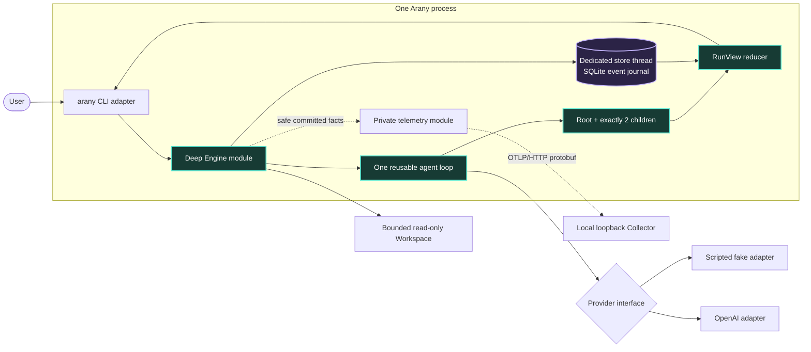
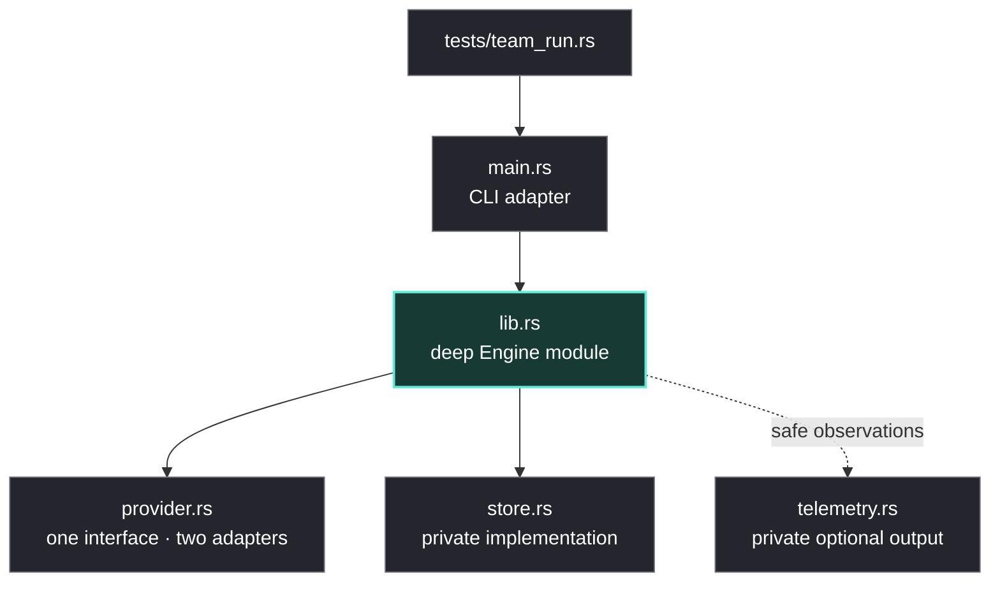
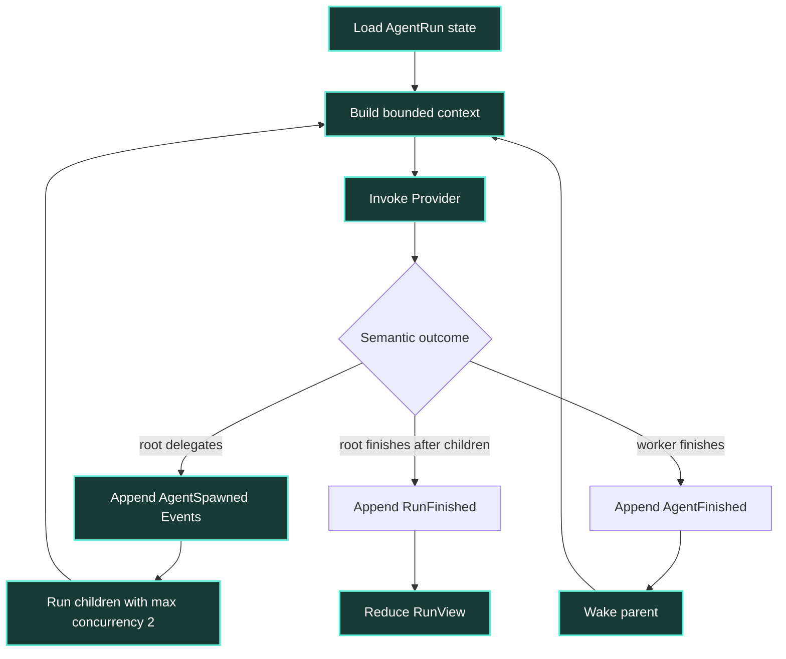
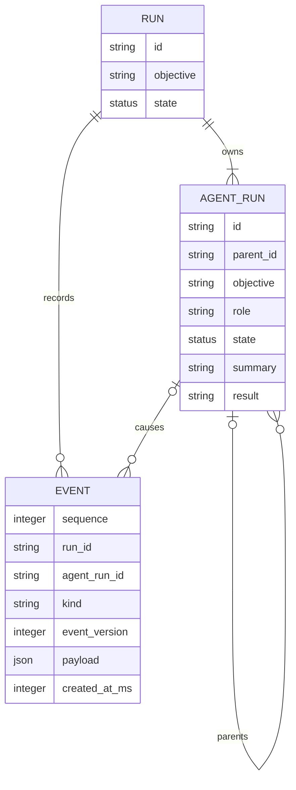

# Minimum Arany architecture

**Status:** canonical first implementation  
**Date:** 2026-09-29  
**Design rule:** prove the agent team before building the platform

The research documents describe the larger design space. This document defines the code that should exist first; the reconciled constants, dependencies, failure behavior, and evidence gates live in the [next-step decision register](../research/next-step-decision-register.md). Anything absent here is not a module waiting to be scaffolded; it is deferred until a measured need earns it.

## 1. What the first slice must prove

One command must demonstrate the product idea:

```text
arany run \
  "Compare these architecture documents and identify the three highest-risk decisions" \
  --include CONTEXT.md \
  --include docs/architecture/system-overview.md
```

The proof is successful when:

1. one root `AgentRun` delegates exactly two bounded read-only objectives;
2. root and children execute through the same agent loop;
3. the terminal shows each `AgentRun` state and attributed summary;
4. the root cannot finish before both children finish;
5. a deterministic fake and OpenAI satisfy the same Provider interface;
6. exact Workspace-root `AGENTS.md` is loaded first, with exact `CLAUDE.md` as absence-only fallback;
7. `arany show <run-id>` reconstructs the same result after process exit; and
8. `Ctrl-C` cancels the root and every active child.

Before repository input is consumed, startup resolves trusted CLI/process configuration, admits a private state root outside the Workspace, and pins the caller-selected Workspace as a directory capability. It does not inspect Git or repository configuration, `.env`, hooks, filters, plugins, packages, tests, or startup commands. The Engine then resolves exact Workspace-root `AGENTS.md`; only when it is absent does exact Workspace-root `CLAUDE.md` apply. It rejects every symlink/reparse component, reads through the opened handle once, and records the selected relative path and SHA-256 digest in `RunStarted`. Explicit `--include` files use the same bounded no-follow snapshot path. The model receives immutable bytes, never a pathname it can reopen. This slice has no model-driven or effectful Tool and therefore makes no sandbox or arbitrary-code-containment claim.

## 2. Runtime architecture

There is one package, one process, and one Engine behavior seam. Optional OTLP export is a private, lossy edge module rather than a second source of truth or a second behavior seam.



Only Provider is an Engine behavior seam because two implementations exist immediately: deterministic fake and OpenAI. SQLite, replay, Workspace reading, context assembly, scheduling, terminal feedback, and optional telemetry export are private Engine implementation details. The async coordinator runs on one current-thread Tokio runtime; one named standard-library thread owns the sole synchronous SQLite connection so a durable commit never blocks provider I/O. When OTLP is enabled, a separate bounded batch thread owns export so telemetry cannot delay or determine the Run outcome.

The Engine owns lifecycle and ordering. The model may propose delegation or completion; it does not own task scheduling, state, cancellation, or terminal truth.

## 3. Codebase diagram

Start with the fewest files that keep terminal concerns out of the Engine:

```text
Cargo.toml
src/
├── main.rs          CLI parsing, terminal rendering, composition
├── lib.rs           Engine, reusable loop, AgentRun tree, RunView
├── provider.rs      Provider interface + fake and OpenAI adapters
├── store.rs         private SQLite thread, migration, append, and replay
└── telemetry.rs     optional private OTLP trace projection
tests/
└── team_run.rs      one deterministic end-to-end proof
```



Do not create `domain`, `protocol`, `adapters`, `memory`, `artifacts`, `scheduler`, `projections`, or `evaluation` crates. A private function may become a module when its implementation grows; a module becomes a crate only when release, privilege, dependency, compile, or ownership pressure is measured.

## 4. Small Engine interface

The CLI needs only three behaviors:

- start a Run from an objective, Workspace, and explicit bounded input files;
- observe the current RunView and live Events; and
- cancel the active Run.

`arany show <run-id>` opens the Engine, replays stored Events, and renders the resulting RunView. It is not a second Client and does not justify a process protocol.

The Provider interface accepts compiled agent input plus an Engine-owned phase and returns one of two semantic outcomes:

- `Delegate`: the planning root returns exactly two bounded child objectives;
- `Finish`: an AgentRun returns its summary and result.

The only valid phase/outcome pairs are `RootPlan + Delegate`, `ChildWork + Finish`, and `RootSynthesis + Finish`. This produces exactly four Provider calls on the success path. The OpenAI adapter requests one bounded non-streaming Responses result with strict Structured Outputs; provider-specific types and raw bodies do not enter Engine state.

Workspace input is not a Tool seam. It is validated CLI input: explicit relative paths, handle-relative no-follow resolution, regular UTF-8 files only, immutable byte snapshots, and fixed per-file and total limits. Those limits are constants until real usage proves they need configuration.

Instruction discovery is also private Engine implementation, not a seam: exact root `AGENTS.md`, otherwise exact root `CLAUDE.md`, otherwise no repository instruction file. No recursive search, imports, aliases, or compatibility modes exist in this slice.

Telemetry follows the same rule. `telemetry.rs` accepts only a typed allowlist of safe operational fields and projects them to OTLP traces. It cannot inspect provider requests, Event payloads, objectives, summaries, results, file names, paths, or file contents. No telemetry trait appears in the Engine API.

## 5. One reusable loop

The role changes what the loop may return, not how the loop executes.



Fixed rules replace configuration:

- exactly one root orchestrator;
- exactly two children, invoked concurrently;
- children cannot create descendants;
- all children are required;
- no automatic retry;
- cancellation flows from root to children; and
- only the root produces the final answer.

These rules are implementation, not extension points.

## 6. Minimum data model

There are three domain concepts and one persisted table.



`Run` and `AgentRun` are reconstructed state, not separate SQL tables. SQLite persists only Events:

```sql
CREATE TABLE events (
    sequence       INTEGER PRIMARY KEY,
    run_id         TEXT NOT NULL,
    agent_run_id   TEXT,
    kind           TEXT NOT NULL,
    event_version  INTEGER NOT NULL CHECK (event_version >= 1),
    payload        TEXT NOT NULL CHECK (json_valid(payload)),
    created_at_ms  INTEGER NOT NULL
) STRICT;

CREATE INDEX events_by_run ON events (run_id, sequence);

PRAGMA user_version = 1;
```

The one connection opens read-write/create with `SQLITE_OPEN_NOFOLLOW` and uses SQLite defensive mode, `journal_mode=DELETE`, `synchronous=EXTRA`, `trusted_schema=OFF`, a 250 ms busy timeout, and short `BEGIN IMMEDIATE` append transactions. The private state root is resolved before repository input, lives outside the Workspace, is limited to a verified local filesystem, and enforces current-user ownership plus private permissions/ACL. Plain `INTEGER PRIMARY KEY` is sufficient because V1 never deletes Events; `AUTOINCREMENT` would add work without serving an identity requirement. Each Event payload is bounded to 64 KiB. A 4 KiB page size and 65,536-page maximum cap the database at 256 MiB; a new Run requires 4 MiB headroom. A logical transition commits before its Events are reduced or rendered.

The first event vocabulary is deliberately small:

- `RunStarted`
- `AgentSpawned`
- `AgentUpdated`
- `AgentFinished`
- `RunFinished`

`AgentUpdated` carries an attributed, bounded summary and state. A failed or cancelled outcome is data inside `AgentFinished` or `RunFinished`; it does not need another entity.

No `Session`, `Command`, `Message`, `Assignment`, `Memory`, `Artifact`, snapshot, cache, or search index exists in this slice.

## 7. One feedback model

The Engine reduces Events into one `RunView`:

```text
RunView
├── run id, objective, state, final result
├── root AgentRun
├── child AgentRuns[]
│   └── id, parent, objective, state, attributed summary, result
└── stored Events[] in sequence order
```

The CLI renders the same RunView in two modes:

- human terminal: append-only committed progress on stderr and the final result on stdout;
- `--jsonl`: one compact persisted Event per stdout line, with diagnostics on stderr.

Human prefixes use trusted stable labels plus typed IDs; repository/model text never supplies a prefix. Root wait lines identify the outstanding worker IDs and count. Before the Run terminates, every worker has one persisted success, failure, or cancellation outcome even when no result exists. The terminal Run fact separates outcome, usage, and recovery: Run ID, terminal reason, last committed sequence, calls used/limit, provider-reported token fields when available, elapsed time, and the exact `arany show` command. Usage provenance is explicit and V1 never fabricates currency cost. This durable receipt lets a consumer detect a truncated stream and replay the committed truth.

TTY detection, color, cursor movement, width calculation, and resize handling do not exist in V1. Overview, tree, timeline, and attention remain future renderings or filters of the same data; they are not separate Engine modules or persisted projections.

## 8. Optional OTLP trace projection

OTLP trace export is an opt-in second V1 patch, added only after the core four-call team run, replay, and cancellation proof passes. The SQLite Events journal remains canonical product truth; telemetry may be delayed, dropped, unavailable, or disabled without changing Run state or exit status.

The initial contract is intentionally narrow:

- export traces only through OTLP/HTTP binary protobuf;
- accept only an explicit numeric loopback Collector endpoint over `http` (`127.0.0.0/8` or `::1`), with redirects and ambient proxies disabled;
- let the local Collector own remote TLS, authentication, secrets, routing, and vendor-specific configuration;
- emit one workflow span, one root-agent span, one planning span, four provider-call spans, and two child-agent spans on the successful fixed workflow;
- use only bounded identifiers, phases, outcomes, event kinds/sequences, durations, and optional bounded model/token metadata;
- never export prompts, objectives, instructions, summaries, results, file metadata or contents, Event payloads, provider bodies, headers, or credentials;
- bound the queue to 256 ended spans, batches to 64, export attempts to two, export timeout to 500 ms, and normal telemetry shutdown to 750 ms; and
- run exporter batching outside the current-thread Tokio coordinator.

Configuration precedence is `--otlp-endpoint`, then `OTEL_EXPORTER_OTLP_TRACES_ENDPOINT`, then `OTEL_EXPORTER_OTLP_ENDPOINT`; absence disables telemetry. Invalid explicit telemetry configuration fails before `RunStarted` with exit 2. A valid but unavailable Collector produces one safe runtime diagnostic and never changes an already-started Run's outcome. The complete mapping, dependency choice, privacy contract, performance gates, and lifecycle design are in [OTLP observability](../research/otlp-observability.md).

## 9. V1 security boundary

The minimum slice has a deliberately narrow claim. Authority originates only from explicit CLI/user configuration, compiled constants, and deterministic Engine rules established before project input. Repository instructions, provider output, child messages, and restored Events are untrusted data. They cannot choose or widen a Workspace, state root, endpoint, model, credential, budget, agent topology, policy, instruction role, or telemetry destination.

The release boundary is:

- no shell, subprocess, write-capable filesystem operation, arbitrary fetch, MCP, runtime plugin, listener, callback, self-update, or response temporary file;
- SQLite opened no-follow in a private, owner-verified, local state directory outside the Workspace, with defensive mode, strict data-only replay, a 256 MiB page cap, and 4 MiB admission headroom;
- one aggregate Run budget reserves the fixed four Provider calls and maximum output-token allowance before `RunStarted`; descendants only consume that budget;
- fixed Provider origin and path, with redirects, ambient proxies and credentials, cookies, retries, and provider-side storage disabled; only phase-required typed data may enter a request;
- human output neutralizes terminal and bidirectional controls, while JSONL is serializer-produced and one object per line; and
- a pinned/reviewed Rust supply chain with application `unsafe` forbidden and bundled SQLite recorded as the explicit native exception.

After the gates pass, this can claim explicit bounded Workspace reads, fixed Provider egress, typed private local state, inert output, and the absence of local model-driven effects. It cannot claim encryption at rest, protection from the local OS account or a compromised host/provider, multi-user isolation, exact currency enforcement for an in-flight request, availability, or sandboxing. The full incident evidence, platform matrix, and verification corpus are in [Harness security lessons and controls](../research/harness-security-lessons-and-controls.md).

## 10. The proof test

`tests/team_run.rs` is the architecture test. Its temporary Workspace contains `AGENTS.md`, `CLAUDE.md`, and two explicit text fixtures. A scripted Provider must drive this exact path:

```text
RunStarted
└── root running
    ├── worker A spawned → running → finished
    ├── worker B spawned → running → finished
    └── root waiting → running → finished
RunFinished
```

The test's acceptance value is one `ObservationBundle`: exit class, exact stdout bytes, exact stderr bytes, Events reopened after closing the SQLite writer, and the RunView reduced from those Events. The deterministic journey uses the real CLI adapter, Engine, file-backed SQLite, reducer, and renderers in-process; only Provider is scripted. A compact subprocess table separately proves the shipped binary's parsing, streams, exits, signals, and `show`. One ignored paid OpenAI smoke is the only complete live `run` through the shipped executable. The [testing strategy](../research/testing-strategy-for-rust-cli-harness.md) owns admission, golden, corpus, flake, deletion, platform, and execution-lane rules.

The test verifies:

- root and workers pass through the same loop;
- `AGENTS.md` wins when both instruction files exist and `CLAUDE.md` is used only when `AGENTS.md` is absent;
- the selected instruction path and digest are recorded in `RunStarted`;
- only the explicitly included files reach Provider input;
- malicious repository/Git configuration, `.env`, hooks, filters, `fsmonitor`, plugin metadata, package metadata, and trust-looking instruction text cause no startup action or authority change;
- traversal, every symlink/reparse component, non-regular files, and oversized input are rejected;
- the state root is admitted before repository input, rejects links/type/owner/permission-or-ACL/local-filesystem failures, opens SQLite no-follow in defensive mode, and enforces aggregate page headroom;
- no third worker is admitted;
- root completion before child completion is rejected;
- the root and children consume one reserved four-call/token budget and cannot manufacture more authority from text;
- every visible state is derived from persisted Events;
- replay after process exit produces the same RunView;
- instruction-looking Event text remains display data and never becomes guidance, policy, configuration, or a later request;
- every logical transition is committed before feedback and a forced death leaves either the old or the complete new transition;
- an incomplete committed prefix is shown as `Interrupted`, never fictional `Cancelled`;
- cancellation reaches every active child; and
- the human renderer and JSONL expose the same facts without executing terminal controls, forging status lines, or leaking omitted-input/secret canaries.

The long verification lists above are implemented as a handful of scenario, table, corpus, and failpoint owners, not one test per bullet or private function. An opt-in live test then runs the same scenario through OpenAI. No second hosted Provider is needed to prove the seam.

## 11. Explicitly deferred

Deferred means no file, trait, table, placeholder, or configuration is created yet.

| Add only when | Then introduce |
|---|---|
| The first effectful Tool is added | Immutable typed `EffectIntent`, deterministic Policy, digest-bound `ApprovalProof`, and separate attesting Guard before that Tool ships |
| A second Client or detached execution exists | Daemon and versioned process protocol |
| Sibling dependencies or ownership transfer are required | Assignment DAG, join policies, leases, and fencing |
| Agents may write concurrently | Isolated Workspace views and an integration owner |
| Follow-up objectives must share a durable conversation | Session |
| Knowledge must survive and improve a later Run | Memory plus retrieval evaluation |
| Event payload limits are exceeded | Content-addressed Artifacts |
| Replay exceeds a measured startup budget | Snapshots |
| A live second process must read during a Run, or durable rollback commits miss their budget | Benchmark a WAL-reset-fixed SQLite with `synchronous=FULL`, checkpoint metrics, and Backup API semantics |
| Lexical search is needed | FTS5; vectors only after a labelled quality gap |
| OpenAI blocks required behavior | A second hosted Provider adapter |
| A real Client needs partial model output or measured time-to-first-useful-output | Bounded provider streaming, SSE compatibility, and partial-output semantics |
| Tools require external processes | Process supervision, then MCP or PTY only for a named case |
| Repeated trials need release statistics | Evaluation runner |
| A browser or remote product exists | HTTP/SSE and a new trust model |
| A direct remote telemetry backend is required | Explicit TLS, authentication, secret, proxy, and trust policy; do not bypass the local Collector boundary |
| Operational questions require process-wide signals beyond traces | Evaluate bounded OTLP metrics without turning them into product truth |
| Field diagnosis requires non-canonical records that Events cannot answer | Add a separately governed structured-log design; do not export Event payloads as OTLP logs |

The [security incident report](../research/harness-security-lessons-and-controls.md) is authoritative for V1 release gates and for the moment an effectful Tool is introduced. V1 security is not deferred: startup authority, state, egress, replay, output, aggregate budgets, and supply chain are part of the first slice. Effect containment is deferred with effectful Tools, never replaced by prompts, hooks, regexes, approval UI, or pretend in-process enforcement.

## 12. Implementation order

1. Write the implementation plan with the V1 security claim, non-claims, P0 controls, platform evidence, failure behavior, and D-15 testing evidence owners.
2. Create the package with application `unsafe` forbidden, pinned toolchain/lockfile, minimal features, and a reviewed build/proc-macro/native/Skill inventory.
3. Implement and adversarially test startup ordering, private state-root admission, Workspace capability snapshots, fixed limits, and inert human/JSONL output before any live Provider call.
4. Add the hardened dedicated store thread, persist the five Event kinds, enforce aggregate page admission, and prove commit-before-feedback, strict data-only replay, corruption/disk failure, and interrupted recovery.
5. Make the fixed four-call scripted `team_run` produce the complete observation bundle under one aggregate Run budget; add graceful/forced cancellation and prove every task and thread is reaped.
6. Add the bounded fixed-origin OpenAI adapter, hostile-network and secret/egress-canary tests, then run the same scenario live.
7. Run the complete native Linux and macOS security, fault, supply-chain, packaging, and performance gates and publish exact claims/non-claims. Windows remains unsupported until its own platform suite passes.
8. In a separate patch, add the private opt-in OTLP trace projection and prove topology, privacy, bounded failure, cancellation, and disabled-path overhead.

Stop there. That is the minimum honest demonstration of Arany plus its optional standard observability edge.
